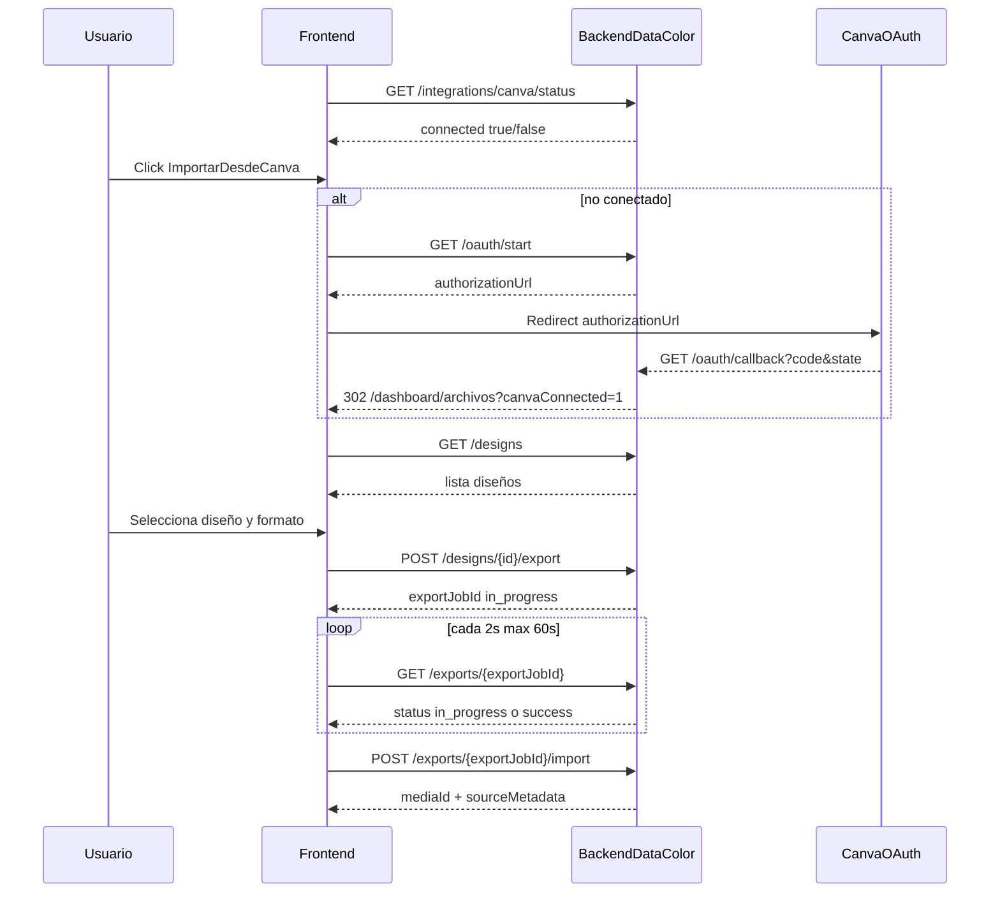

# Guía frontend: integración Canva (Gestor de archivos)

Documento para el equipo frontend con el flujo backend implementado para importar diseños desde Canva mediante selector propio (sin picker nativo de Canva).

**Referencia técnica backend:** [`docs/Documentos requerimientos/canva-implementacion-gestor-archivos.md`](Documentos%20requerimientos/canva-implementacion-gestor-archivos.md)

---

## 1. Objetivo funcional

- Conectar cuenta Canva desde el gestor de archivos.
- Listar diseños del usuario en una grilla propia.
- Exportar un diseño (PNG, JPG o MP4) e importarlo a la biblioteca interna.
- Mostrar estado de conexión por tenant y usuario.

---

## 2. Endpoints backend involucrados

### OAuth y estado (genéricos, `provider = canva`)

| Acción | Endpoint | Auth |
|--------|----------|------|
| Estado de conexión | `GET /api/integrations/canva/status` | JWT + `TenantMember` |
| Iniciar OAuth | `GET /api/integrations/canva/oauth/start` | JWT + `TenantMember` |
| Callback OAuth | `GET /api/integrations/canva/oauth/callback?code=...&state=...` | `AllowAnonymous` |
| Desconectar | `POST /api/integrations/canva/disconnect` | JWT + `TenantMember` |

### Diseños, exportación e importación

| Acción | Endpoint | Auth |
|--------|----------|------|
| Listar diseños | `GET /api/integrations/canva/designs` | JWT + `TenantMember` |
| Detalle de diseño | `GET /api/integrations/canva/designs/{designId}` | JWT + `TenantMember` |
| Formatos exportables | `GET /api/integrations/canva/designs/{designId}/export-formats` | JWT + `TenantMember` |
| Iniciar exportación | `POST /api/integrations/canva/designs/{designId}/export` | JWT + `TenantMember` |
| Estado de exportación | `GET /api/integrations/canva/exports/{exportJobId}` | JWT + `TenantMember` |
| Importar exportación | `POST /api/integrations/canva/exports/{exportJobId}/import` | JWT + `TenantMember` |

Headers en endpoints autenticados:

- `Authorization: Bearer <jwt>`
- `X-Tenant-Id: <tenantIdActivo>`

---

## 3. Flujo UX recomendado



---

## 4. Query params post-OAuth

Tras el callback, el backend redirige a:

- Éxito: `/dashboard/archivos?canvaConnected=1`
- Error: `/dashboard/archivos?canvaConnected=0&canvaError=<code>`

El frontend debe:

1. Detectar `canvaConnected` y opcionalmente `canvaError`.
2. Mostrar toast de éxito/error.
3. Limpiar query params de la URL.
4. Volver a consultar `GET /api/integrations/canva/status`.

---

## 5. Listado de diseños

```http
GET /api/integrations/canva/designs?query=campaña&pageSize=20&ownership=any&sortBy=modified_desc
```

| Query param | Valores | Default |
|-------------|---------|---------|
| `ownership` | `owned`, `shared`, `any` | `any` |
| `sortBy` | `modified_desc`, `modified_asc`, `created_desc`, `created_asc` | `modified_desc` |
| `pageSize` | 1–50 | 20 |
| `continuation` | token de página anterior | — |

Respuesta:

```json
{
  "data": {
    "provider": "canva",
    "items": [
      {
        "designId": "DAFxxxxxx",
        "title": "Campaña junio",
        "thumbnailUrl": "https://...",
        "createdAt": "2026-06-20T10:00:00Z",
        "updatedAt": "2026-06-20T12:00:00Z",
        "owner": "me"
      }
    ],
    "continuation": "next_page_token"
  }
}
```

Usar `continuation` para infinite scroll o botón «Cargar más».

---

## 6. Exportación e importación

### Iniciar exportación

```http
POST /api/integrations/canva/designs/{designId}/export
```

```json
{
  "format": "png",
  "pages": [1],
  "quality": 100
}
```

**MVP:** para `png`/`jpg`, solo **una página** en `pages`. Para `mp4`, omitir `pages`.

### Polling de estado

```http
GET /api/integrations/canva/exports/{exportJobId}
```

| Parámetro | Valor |
|-----------|-------|
| Intervalo | 2 s |
| Timeout UI | 60 s |
| Acción en `success` | Llamar import |
| Acción en `failed` | Mostrar error |

**Importante:** la respuesta de polling **no incluye URLs de descarga** de Canva. Solo metadata:

```json
{
  "data": {
    "provider": "canva",
    "exportJobId": "export_abc123",
    "status": "success",
    "files": [
      {
        "format": "png",
        "page": 1,
        "expiresAt": "2026-06-21T10:00:00Z"
      }
    ]
  }
}
```

### Importar a biblioteca

```http
POST /api/integrations/canva/exports/{exportJobId}/import
```

```json
{
  "name": "campana-junio.png",
  "tags": ["canva", "campaña"],
  "sourceDesignId": "DAFxxxxxx"
}
```

Respuesta:

```json
{
  "data": {
    "mediaId": 123,
    "name": "campana-junio.png",
    "mimeType": "image/png",
    "sizeBytes": 340000,
    "publicUrl": "https://...",
    "thumbnailUrl": "https://...",
    "source": "canva",
    "sourceMetadata": {
      "provider": "canva",
      "designId": "DAFxxxxxx",
      "exportJobId": "export_abc123",
      "format": "png",
      "page": 1
    }
  }
}
```

---

## 7. Estados de UI sugeridos

```text
disconnected | connecting | loading_designs | empty | searching
selecting | loading_formats | exporting | waiting_export
importing | success | error
```

Mensajes sugeridos:

- «Conectando con Canva...»
- «Canva conectado correctamente.»
- «No se pudo conectar Canva.»
- «Exportando diseño...»
- «Diseño importado correctamente.»
- «La exportación tardó más de lo esperado.»

---

## 8. Códigos de error relevantes

| Código | Cuándo |
|--------|--------|
| `INTEGRATION_NOT_CONNECTED` | Sin OAuth activo |
| `CANVA_AUTH_FAILED` | Fallo en OAuth |
| `CANVA_DESIGN_NOT_FOUND` | Diseño inexistente |
| `CANVA_EXPORT_NOT_READY` | Import antes de `success` |
| `CANVA_EXPORT_EXPIRED` | URL de export expirada |
| `CANVA_EXPORT_MULTIPLE_FILES_NOT_SUPPORTED` | Multipágina no soportada en MVP |
| `CANVA_CONNECTION_REVOKED` | Reconectar cuenta |
| `MEDIA_QUOTA_EXCEEDED` / `MEDIA_TOO_LARGE` / `MEDIA_INVALID_TYPE` | Validación de media |

---

## 9. Servicio Angular sugerido

```typescript
@Injectable({ providedIn: 'root' })
export class CanvaIntegrationService {
  private readonly base = '/api/integrations/canva';

  getStatus() {
    return this.http.get<ApiResponse<IntegrationStatusDto>>(`${this.base}/status`);
  }

  startOAuth() {
    return this.http.get<ApiResponse<IntegrationOAuthStartResponseDto>>(`${this.base}/oauth/start`);
  }

  disconnect() {
    return this.http.post<ApiResponse<void>>(`${this.base}/disconnect`, {});
  }

  listDesigns(params: Record<string, string | number>) {
    return this.http.get<ApiResponse<CanvaDesignListResponseDto>>(`${this.base}/designs`, { params });
  }

  getExportFormats(designId: string) {
    return this.http.get<ApiResponse<CanvaExportFormatsResponseDto>>(
      `${this.base}/designs/${designId}/export-formats`);
  }

  startExport(designId: string, body: CanvaExportRequestDto) {
    return this.http.post<ApiResponse<CanvaExportStartResponseDto>>(
      `${this.base}/designs/${designId}/export`, body);
  }

  getExportStatus(exportJobId: string) {
    return this.http.get<ApiResponse<CanvaExportStatusResponseDto>>(
      `${this.base}/exports/${exportJobId}`);
  }

  importExport(exportJobId: string, body: CanvaImportExportRequestDto) {
    return this.http.post<ApiResponse<CanvaImportResultDto>>(
      `${this.base}/exports/${exportJobId}/import`, body);
  }
}
```

---

## 10. Checklist QA frontend

- [ ] `GET /status` devuelve `connected=false` antes de conectar.
- [ ] OAuth termina en redirect con `canvaConnected=1` o `canvaConnected=0`.
- [ ] Modal lista diseños con búsqueda y paginación.
- [ ] Solo formatos `png`, `jpg`, `mp4` habilitados según `export-formats`.
- [ ] Polling hasta `success` sin mostrar URLs de Canva al usuario.
- [ ] Import devuelve `mediaId` y `sourceMetadata`.
- [ ] `POST /disconnect` y luego `GET /status` devuelven `connected=false`.
