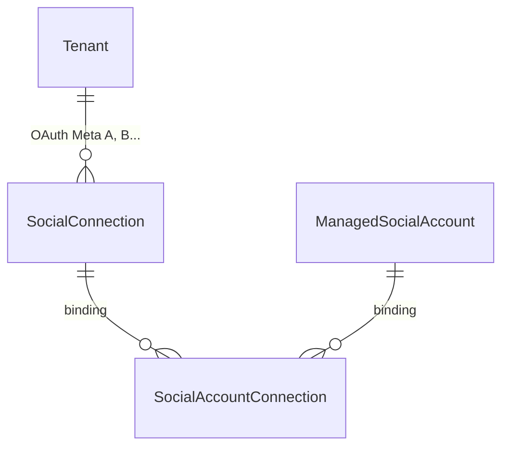
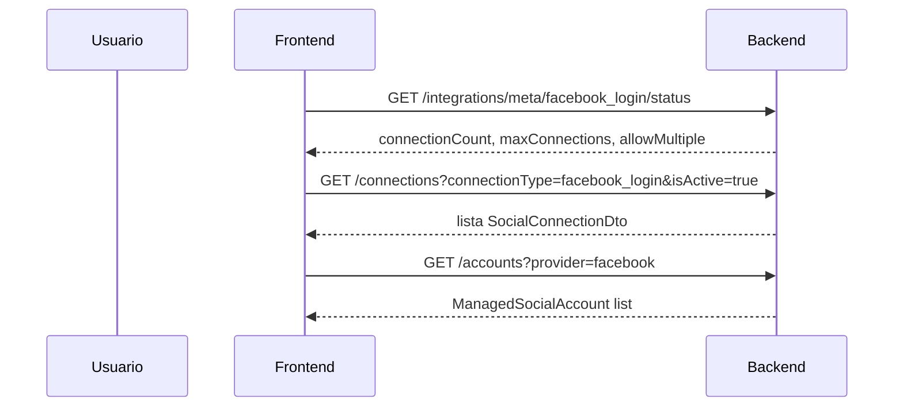

# Guía frontend: Multi-OAuth por tenant (Facebook Login)

Documento para el equipo frontend con el flujo backend implementado en **Fase 1**: varias cuentas Meta OAuth (`SocialConnection`) por tenant en `facebook_login`, gestión por conexión (sync/disconnect/reauth) y bindings cuenta↔conexión (`SocialAccountConnection`).

**Referencia técnica backend:** [`docs/Documentos requerimientos/plan-multi-oauth-facebook-por-tenant.md`](Documentos%20requerimientos/plan-multi-oauth-facebook-por-tenant.md)  
**Catálogo HTTP general:** [`docs/endpoints-redes-sociales-meta-facebook-linkedin.md`](endpoints-redes-sociales-meta-facebook-linkedin.md)

---

## 1. Objetivo funcional

Permitir que un mismo tenant conecte **varios usuarios Meta** para Facebook Pages (caso piloto: usuario A con 4 páginas + usuario B con 2 páginas → 6 cuentas publicables y 2 conexiones OAuth activas).

El frontend debe poder:

- Mostrar **cuántas conexiones OAuth** hay por `connectionType` (no solo conectado sí/no).
- **Añadir** otra cuenta Meta sin desconectar la anterior (`mode=add`).
- **Reautenticar** una conexión concreta cuando expire el token (`mode=reauth&connectionId=`).
- **Sincronizar** o **desconectar** una conexión específica sin afectar las demás.
- Visualizar, cuando aplique, si una página está vinculada a **varias conexiones** (página compartida entre usuarios Meta).

**Fuera de alcance Fase 1 (no implementar aún en UI):** límites comerciales por plan (`limit.social.connections.*`), `DisplayLabel` por conexión, fallback de publish entre bindings.

---

## 2. Qué cambió respecto al comportamiento anterior

| Antes | Ahora (`facebook_login`) |
|-------|---------------------------|
| Un solo OAuth Meta activo por tenant; el 2.º OAuth **revocaba** el 1.º | Varios OAuth activos si `AllowMultipleConnectionsPerTenant: true` |
| Status con un solo `connectionId` implícito | `connectionCount` + lista en `/api/social/connections` |
| Disconnect/sync actuaban sobre “la” conexión | Disconnect/sync **por `connectionId`** o bulk legacy |
| Token de página solo en `ManagedSocialAccount` | Token canónico en binding; cuenta mantiene **caché** para publish |

**Instagram (`instagram_login`) y LinkedIn (`linkedin_oauth`):** siguen con **una conexión activa** (`AllowMultipleConnectionsPerTenant: false`). El API es el mismo; la UI multi-conexión solo aplica hoy a Facebook Login.

**Publicación (`POST /api/social/post-plans`):** sin cambios. Sigue usando `ManagedSocialAccount.canPublish` y la caché de token en cuenta.

---

## 3. Modelo conceptual para la UI



| Concepto | Qué representa en UI | Ejemplo |
|----------|----------------------|---------|
| **SocialConnection** | Una sesión OAuth de un usuario Meta | “Cuenta Meta de Juan”, `externalUserId: 123456789` |
| **ManagedSocialAccount** | Una página FB (destino de publicación) | “Mi Tienda Online” |
| **SocialAccountConnection (binding)** | Enlace página ↔ conexión OAuth con token de página | Misma página visible desde 2 conexiones si ambos usuarios Meta la administran |

Regla clave para disconnect: al desconectar la **conexión A**, solo se revocan las páginas que **dependían exclusivamente** de A. Si una página tiene otro binding activo (conexión B), **sigue activa** con el token de B.

---

## 4. Headers comunes

En todos los endpoints autenticados:

```http
Authorization: Bearer <jwt>
X-Tenant-Id: <tenantIdActivo>
```

Política: `TenantMember` (salvo callback OAuth, anónimo).

Formato de respuesta: `{ "data": { ... } }` en `camelCase` (`ApiResponse<T>`).

---

## 5. Endpoints nuevos

Base: `/api/social/connections`

| Acción | Método | Ruta | Descripción |
|--------|--------|------|-------------|
| Listar conexiones | `GET` | `/api/social/connections` | Filtros opcionales en query |
| Detalle conexión | `GET` | `/api/social/connections/{connectionId}` | Una conexión del tenant |
| Sync scoped | `POST` | `/api/social/connections/{connectionId}/sync` | Sincroniza páginas de **esa** conexión |
| Disconnect scoped | `POST` | `/api/social/connections/{connectionId}/disconnect` | Revoca bindings de **esa** conexión |

**Query params de listado (`GET /connections`):**

| Param | Tipo | Ejemplo |
|-------|------|---------|
| `providerGroup` | string | `meta` |
| `connectionType` | string | `facebook_login` |
| `isActive` | bool | `true` |

**Respuesta (`SocialConnectionDto`):**

```json
{
  "data": [
    {
      "id": 12,
      "providerGroup": "meta",
      "connectionType": "facebook_login",
      "externalUserId": "1029384756",
      "isActive": true,
      "tokenStatus": "Valid",
      "lastSyncAt": "2026-06-27T16:00:00Z",
      "lastSyncStatus": "success",
      "activeAccountCount": 4,
      "totalAccountCount": 4
    }
  ]
}
```

`externalUserId` es el ID de usuario Meta (no el nombre). En Fase 2 podrá existir `displayLabel`; hoy mostrar ID truncado o fecha de última sync.

---

## 6. Endpoints modificados

### 6.1 Iniciar OAuth — query `mode` y `connectionId`

```http
GET /api/social/connect/meta/facebook_login/start?mode=add
GET /api/social/connect/meta/facebook_login/start?mode=reauth&connectionId=12
```

| Query | Valores | Default | Uso |
|-------|---------|---------|-----|
| `mode` | `add`, `reauth` | `add` | Añadir conexión vs renovar token de una existente |
| `connectionId` | int | — | **Obligatorio** si `mode=reauth` |

Respuesta sin cambios:

```json
{
  "data": {
    "authorizationUrl": "https://www.facebook.com/v24.0/dialog/oauth?..."
  }
}
```

Flujo UX:

1. Redirigir al usuario a `authorizationUrl`.
2. Meta redirige al callback backend (`/api/social/connect/.../callback`).
3. Tras éxito, refrescar status y lista de conexiones/cuentas.

**Errores relevantes en `start` / `callback`:**

| HTTP | `errorCode` | Cuándo |
|------|-------------|--------|
| `409` | `SOCIAL_CONNECTION_LIMIT_REACHED` | Tenant alcanzó `maxConnectionsPerTenant` (default **3** en config) |
| `409` | `SOCIAL_CONNECTION_REAUTH_REQUIRED` | `mode=reauth` sin `connectionId` |
| `404` | `SOCIAL_CONNECTION_NOT_FOUND` | `connectionId` inexistente o de otro tenant |

### 6.2 Status por connectionType — campos nuevos

```http
GET /api/social/integrations/meta/facebook_login/status
```

Campos **nuevos** en `SocialConnectionTypeStatusDto`:

```json
{
  "data": {
    "providerGroup": "meta",
    "connectionType": "facebook_login",
    "connected": true,
    "connectionId": 12,
    "connectionCount": 2,
    "allowMultipleConnectionsPerTenant": true,
    "maxConnectionsPerTenant": 3,
    "tokenStatus": "Valid",
    "totalAccounts": 6,
    "activeAccounts": 6,
    "inactiveAccounts": 0,
    "lastSyncAt": "2026-06-27T16:00:00Z",
    "lastSyncStatus": "success",
    "lastSyncAccountsUpserted": 2,
    "hasInactiveAccounts": false,
    "syncInProgress": false,
    "accountsReady": true,
    "requiresReconnect": false
  }
}
```

**Compatibilidad §9 del plan:**

- Usar `connectionCount` como fuente de verdad: `connected === connectionCount > 0` (equivalente legacy: `connected ? 1 : 0`).
- `connectionId` sigue existiendo = **primera conexión activa** (la más reciente en orden interno). Para multi-OAuth, **no** asumir que es la única; usar `GET /connections` para la lista completa.

### 6.3 Sync de cuentas — query `connectionId` opcional

```http
POST /api/social/accounts/sync?providerGroup=meta&connectionType=facebook_login
POST /api/social/accounts/sync?providerGroup=meta&connectionType=facebook_login&connectionId=12
```

| Sin `connectionId` | Con `connectionId` |
|--------------------|--------------------|
| Sincroniza **todas** las conexiones activas del tipo | Solo la conexión indicada |

Respuesta incluye `connectionStatus` actualizado (`SocialSyncAccountsResponseDto`).

### 6.4 Listado de cuentas — query `includeBindings`

```http
GET /api/social/accounts?provider=facebook&includeBindings=true
```

Campos nuevos en `SocialAccountDto`:

```json
{
  "data": [
    {
      "id": 101,
      "provider": "facebook",
      "accountType": "page",
      "displayName": "Página compartida",
      "socialConnectionId": 13,
      "connectionBindings": [
        {
          "socialConnectionId": 12,
          "isActive": true,
          "tokenStatus": "Valid",
          "lastSyncAt": "2026-06-27T15:00:00Z"
        },
        {
          "socialConnectionId": 13,
          "isActive": true,
          "tokenStatus": "Valid",
          "lastSyncAt": "2026-06-27T16:00:00Z"
        }
      ],
      "isActive": true,
      "canPublish": true,
      "tokenStatus": "Valid"
    }
  ]
}
```

- `socialConnectionId`: conexión “primaria” denormalizada en la cuenta (último sync relevante).
- `connectionBindings`: solo si `includeBindings=true`. Útil para badge “2 conexiones” o tooltip en páginas compartidas.

### 6.5 Disconnect bulk (legacy)

```http
POST /api/social/integrations/meta/facebook_login/disconnect
```

Sigue existiendo: desconecta **todas** las conexiones activas de ese `connectionType`. Preferir disconnect scoped por conexión en la nueva UI.

---

## 7. Flujos UX recomendados

### 7.1 Pantalla “Integraciones → Facebook”



Elementos sugeridos:

- Badge: `{connectionCount} / {maxConnectionsPerTenant} cuentas Meta conectadas`.
- Botón **“Conectar otra cuenta Meta”** → `start?mode=add` (solo si `allowMultipleConnectionsPerTenant`).
- Por cada fila de conexión: **Sync**, **Reautenticar** (`mode=reauth&connectionId=`), **Desconectar**.
- Deshabilitar “Conectar otra” si `connectionCount >= maxConnectionsPerTenant`.

### 7.2 Añadir segunda cuenta Meta (escenario 4+2)

1. Usuario ya conectó Meta A (4 páginas).
2. Click “Conectar otra cuenta Meta”.
3. `GET .../start?mode=add` → redirect OAuth.
4. Tras callback: `connectionCount: 2`, `totalAccounts: 6`.
5. Listado de cuentas muestra 6 páginas activas.

### 7.3 Reautenticar una conexión

Cuando `tokenStatus !== Valid` o `requiresReconnect` en una conexión concreta:

```http
GET /api/social/connect/meta/facebook_login/start?mode=reauth&connectionId=12
```

El backend reutiliza la misma fila `SocialConnection` (mismo `externalUserId` tras OAuth).

### 7.4 Desconectar una conexión sin afectar otras

```http
POST /api/social/connections/12/disconnect
```

Efecto esperado (ejemplo A=4 páginas, B=2 páginas):

- Disconnect A → 4 cuentas revocadas/inactivas, 2 de B siguen activas.
- Refrescar `GET /accounts?provider=facebook` y `GET /connections`.

### 7.5 Página compartida entre dos usuarios Meta

- `GET /accounts?includeBindings=true` devuelve **1 cuenta** con `connectionBindings.length === 2`.
- UI: una sola fila de página; indicador “Accesible desde 2 cuentas Meta”.
- Disconnect de una conexión **no** elimina la página si el otro binding sigue activo.

---

## 8. Códigos de error a manejar en UI

| `errorCode` | HTTP | Mensaje sugerido al usuario |
|-------------|------|----------------------------|
| `SOCIAL_CONNECTION_LIMIT_REACHED` | 409 | “Has alcanzado el límite de cuentas Meta conectadas (máx. {max}). Desconecta una antes de añadir otra.” |
| `SOCIAL_CONNECTION_NOT_FOUND` | 404 | “La conexión ya no existe o no tienes acceso.” |
| `SOCIAL_CONNECTION_REAUTH_REQUIRED` | 409 | “Indica qué conexión deseas reautenticar.” |

Mostrar el límite leyendo `maxConnectionsPerTenant` del status, no hardcodear.

---

## 9. Configuración backend relevante para la UI

En `appsettings` (valores actuales piloto):

```json
"SocialProviders": {
  "DefaultMaxConnectionsPerTenant": 3,
  "facebook_login": {
    "AllowMultipleConnectionsPerTenant": true
  }
}
```

| Campo en status | Origen |
|-----------------|--------|
| `allowMultipleConnectionsPerTenant` | Config por `connectionType` |
| `maxConnectionsPerTenant` | Default 3; en Fase 2 podrá venir de entitlement comercial |

---

## 10. Qué **no** cambia en frontend (Fase 1)

| Área | Comportamiento |
|------|----------------|
| Composer / post-plans | Misma selección de cuentas (`forPublishing=true`) |
| Callback OAuth | Misma ruta; respuesta `accountsImported` = páginas upsertadas en **ese** OAuth |
| Instagram / LinkedIn | UI single-connection; mismos endpoints |
| `GET /accounts?forPublishing=true` | Sigue filtrando cuentas publicables |
| Validación de cuenta | `POST /accounts/{id}/validate` sin cambios |

---

## 11. Checklist de implementación frontend

- [x] Sustituir lógica binaria `connected` por `connectionCount` en tarjeta Facebook.
- [x] Consumir `GET /api/social/connections?connectionType=facebook_login` para listado de conexiones.
- [x] Botón “Añadir cuenta Meta” → `start?mode=add`.
- [x] Acción “Reautenticar” por fila → `start?mode=reauth&connectionId={id}`.
- [x] Sync/disconnect por conexión → `/connections/{id}/sync` y `/disconnect`.
- [x] Manejar `409 SOCIAL_CONNECTION_LIMIT_REACHED` en callback OAuth.
- [x] Opcional: `includeBindings=true` para páginas compartidas.
- [x] Mantener disconnect global solo como “Desconectar todas las cuentas Meta” (acción destructiva con confirmación).
- [x] Tras OAuth/sync/disconnect: refrescar status + connections + accounts en paralelo.

---

## 12. Ejemplos de requests (copiar/pegar)

**Status Facebook:**

```http
GET /api/social/integrations/meta/facebook_login/status
Authorization: Bearer <token>
X-Tenant-Id: 1
```

**Listar conexiones activas:**

```http
GET /api/social/connections?providerGroup=meta&connectionType=facebook_login&isActive=true
Authorization: Bearer <token>
X-Tenant-Id: 1
```

**Conectar otra cuenta Meta:**

```http
GET /api/social/connect/meta/facebook_login/start?mode=add
Authorization: Bearer <token>
X-Tenant-Id: 1
```

**Reautenticar conexión 12:**

```http
GET /api/social/connect/meta/facebook_login/start?mode=reauth&connectionId=12
Authorization: Bearer <token>
X-Tenant-Id: 1
```

**Sync solo conexión 12:**

```http
POST /api/social/connections/12/sync
Authorization: Bearer <token>
X-Tenant-Id: 1
```

**Cuentas con bindings (páginas compartidas):**

```http
GET /api/social/accounts?provider=facebook&includeBindings=true
Authorization: Bearer <token>
X-Tenant-Id: 1
```

---

## 13. Migración de datos (contexto)

La migración `AddSocialAccountConnection` creó bindings automáticos desde cuentas existentes. Tenants ya conectados antes del despliegue **no necesitan reconectar**; la UI puede mostrar `connectionCount >= 1` inmediatamente tras el deploy + migración.

---

**Última revisión:** 27 junio 2026  
**Estado backend:** Fase 1 implementada — piloto `facebook_login`
