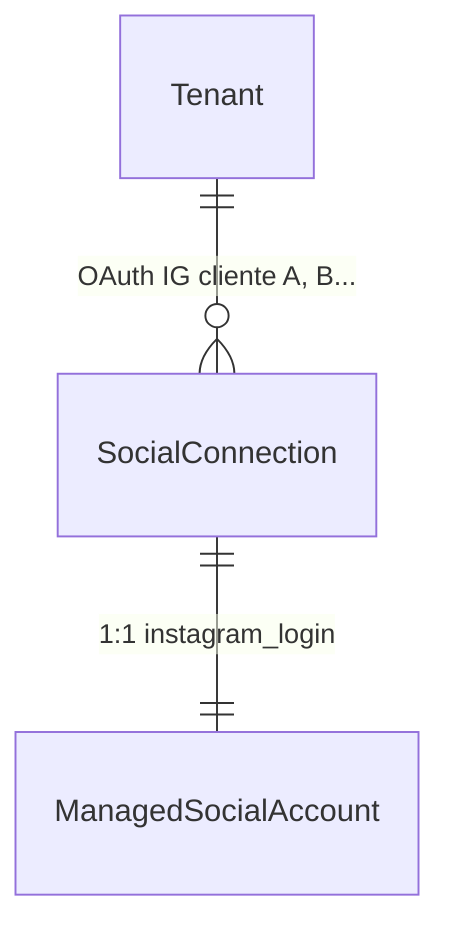
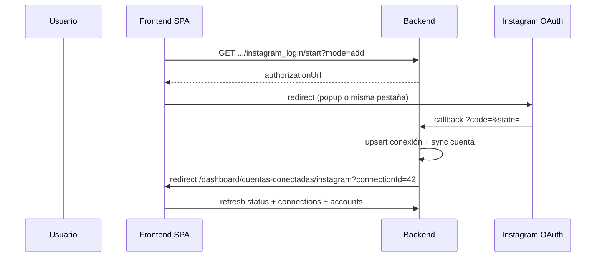

# Guía frontend: Multi-OAuth por tenant (Instagram Login)

Documento para el equipo frontend con el flujo backend implementado en **Fase 0 + Fase 1**: varias cuentas Instagram OAuth (`SocialConnection`) por tenant en `instagram_login`, gestión por conexión (sync/disconnect/reauth) y **1 conexión = 1 cuenta IG** publicable.

**Referencia técnica backend:** [`docs/Documentos requerimientos/plan-multi-oauth-instagram-por-tenant.md`](Documentos%20requerimientos/plan-multi-oauth-instagram-por-tenant.md)  
**Paridad de patrón:** [`docs/frontend-multi-oauth-facebook-por-tenant.md`](frontend-multi-oauth-facebook-por-tenant.md)  
**Catálogo HTTP general:** [`docs/endpoints-redes-sociales-meta-facebook-linkedin.md`](endpoints-redes-sociales-meta-facebook-linkedin.md)

**Ruta SPA sugerida:** `/dashboard/cuentas-conectadas/instagram`

---

## 1. Objetivo funcional

Permitir que un mismo tenant (caso agencia) conecte **varios clientes Instagram** mediante Instagram Login directo: **1 OAuth = 1 cuenta IG**, sin pantalla de selección post-OAuth.

El frontend debe poder:

- Mostrar **cuántas conexiones OAuth** y **cuántas cuentas IG activas** hay (`connectionCount`, `activeInstagramAccounts`).
- **Añadir** otro cliente IG (`mode=add`).
- **Reautenticar** una conexión concreta (`mode=reauth&connectionId=`).
- **Sincronizar** o **desconectar** una conexión específica sin afectar las demás.
- Mostrar cada conexión como tarjeta con `displayLabel` (`@username`).

**Fuera de alcance Fase 1:** bindings IG multi-token (Fase 3), selector post-OAuth, rutas legacy de [`frontend-integracion-instagram-meta.md`](frontend-integracion-instagram-meta.md).

---

## 2. Modelo conceptual para la UI



| Concepto | Qué representa en UI | Ejemplo |
|----------|----------------------|---------|
| **SocialConnection** | Una sesión OAuth de un usuario IG | Tarjeta `@marca_cliente_a`, `externalUserId: 17841400…` |
| **ManagedSocialAccount** | La cuenta IG publicable (misma identidad) | Mismo `@marca_cliente_a` en listado de cuentas |

**Regla de identidad (§2.1 del plan):** `SocialConnection.ExternalUserId === ManagedSocialAccount.ExternalAccountId` para `instagram_login` directo.

**Dual-path (FB + IG):** una cuenta IG puede tener `linkedConnectionTypes: ["facebook_login","instagram_login"]`. Al desconectar solo la conexión IG, la cuenta puede seguir activa vía página FB si la Page está conectada.

---

## 3. Qué cambió respecto al comportamiento anterior

| Antes | Ahora (`instagram_login`) |
|-------|---------------------------|
| Un solo OAuth IG activo; el 2.º podía revocar el 1.º | Varios OAuth activos si `AllowMultipleConnectionsPerTenant: true` |
| Sin `displayLabel` en conexión | `displayLabel` = `@username` (obligatorio Fase 1) |
| Disconnect/sync global | Disconnect/sync **por `connectionId`** |
| Token de publish: primera conexión IG del tenant | Token resuelto por **cuenta** (`ExternalAccountId`) |
| Status binario `connected` | `connectionCount` + `remainingConnections` + cupos IG |

---

## 4. Headers comunes

```http
Authorization: Bearer <jwt>
X-Tenant-Id: <tenantIdActivo>
```

Política: `TenantMember` (callback OAuth anónimo).

Formato: `{ "data": { ... } }` en `camelCase`.

---

## 5. Endpoints (`instagram_login`)

| Acción | Método | Ruta |
|--------|--------|------|
| Status | `GET` | `/api/social/integrations/meta/instagram_login/status` |
| Listar conexiones | `GET` | `/api/social/connections?connectionType=instagram_login` |
| Detalle conexión | `GET` | `/api/social/connections/{connectionId}` |
| Iniciar OAuth (add) | `GET` | `/api/social/connect/meta/instagram_login/start?mode=add` |
| Iniciar OAuth (reauth) | `GET` | `/api/social/connect/meta/instagram_login/start?mode=reauth&connectionId={id}` |
| Callback OAuth | `GET` | `/api/social/connect/meta/instagram_login/callback` (backend; redirect al SPA) |
| Sync scoped | `POST` | `/api/social/connections/{connectionId}/sync` |
| Disconnect scoped | `POST` | `/api/social/connections/{connectionId}/disconnect` |
| Cuentas IG | `GET` | `/api/social/accounts?provider=instagram` |
| Disconnect bulk (legacy) | `POST` | `/api/social/integrations/meta/instagram_login/disconnect` |

### 5.1 Status — campos relevantes

```json
{
  "data": {
    "providerGroup": "meta",
    "connectionType": "instagram_login",
    "connected": true,
    "connectionCount": 2,
    "allowMultipleConnectionsPerTenant": true,
    "maxConnectionsPerTenant": 5,
    "remainingConnections": 3,
    "maxInstagramAccounts": 5,
    "activeInstagramAccounts": 2,
    "remainingInstagramAccounts": 3,
    "totalAccounts": 2,
    "activeAccounts": 2,
    "requiresReconnect": false
  }
}
```

| Campo | Uso en UI |
|-------|-----------|
| `connectionCount` / `maxConnectionsPerTenant` / `remainingConnections` | Badge “2/5 cuentas Meta conectadas” (OAuth) |
| `activeInstagramAccounts` / `maxInstagramAccounts` / `remainingInstagramAccounts` | Badge “2/5 cuentas Instagram activas” (plan comercial) |
| `allowMultipleConnectionsPerTenant` | Mostrar botón “Conectar otro cliente” solo si `true` |

En planes estándar IG, **`limit.social.connections.instagram_login` = `limit.instagram.accounts`** (mismo N).

### 5.2 Conexión (`SocialConnectionDto`)

```json
{
  "id": 42,
  "providerGroup": "meta",
  "connectionType": "instagram_login",
  "externalUserId": "17841400123456789",
  "displayLabel": "@marca_cliente_a",
  "displayPictureUrl": "https://...",
  "isActive": true,
  "tokenStatus": "Valid",
  "activeAccountCount": 1,
  "totalAccountCount": 1,
  "lastSyncAt": "2026-06-30T12:00:00Z"
}
```

Mostrar **`displayLabel`** como título de tarjeta; `externalUserId` solo como detalle técnico.

---

## 6. Flujo OAuth (sin selector post-login)



### Redirect tras callback (config backend)

Éxito:

```
/dashboard/cuentas-conectadas/instagram?connectionId={connectionId}
```

Error:

```
/dashboard/cuentas-conectadas/instagram?igError={errorCode}
```

**No implementar** pantalla de selección de cuenta tras OAuth: el perfil devuelto por Meta define la conexión/cuenta.

### Modos OAuth

| `mode` | `connectionId` | Comportamiento |
|--------|----------------|----------------|
| `add` (default) | — | Nueva conexión o upsert por `profile.id`; evalúa límites |
| `reauth` | obligatorio | Renueva token de **esa** conexión; **no** evalúa límites; valida mismo `externalUserId` |

Para pruebas/API: añadir `responseMode=json` al callback para respuesta JSON en lugar de redirect.

---

## 7. Errores a manejar en UI

| `errorCode` (query `igError` o body) | HTTP | Mensaje sugerido |
|--------------------------------------|------|------------------|
| `SOCIAL_CONNECTION_LIMIT_REACHED` | 409 | “Has alcanzado el límite de conexiones Instagram (máx. {maxConnectionsPerTenant}).” |
| `SOCIAL_IG_ACCOUNT_LIMIT_REACHED` | 409 | “Has alcanzado el límite de cuentas Instagram activas (máx. {maxInstagramAccounts}).” |
| `SOCIAL_CONNECTION_REAUTH_USER_MISMATCH` | 409 | “Iniciaste sesión con otra cuenta de Instagram. Usa la cuenta @… o cancela.” |
| `SOCIAL_CONNECTION_REAUTH_REQUIRED` | 409 | “Indica qué conexión deseas reautenticar.” |
| `SOCIAL_CONNECTION_NOT_FOUND` | 404 | “La conexión ya no existe.” |

**Precedencia en `mode=add`:** primero límite de **conexiones OAuth**, luego límite de **cuentas IG activas**.

**Excepción:** re-OAuth `mode=add` de la **misma** IG ya `Connected` no consume cupo de cuenta (solo actualiza conexión).

Leer límites desde status (`maxConnectionsPerTenant`, `maxInstagramAccounts`), no hardcodear.

---

## 8. Diferencias vs Facebook multi-OAuth

| Aspecto | Facebook (`facebook_login`) | Instagram (`instagram_login`) |
|---------|----------------------------|------------------------------|
| Recurso por OAuth | Muchas Pages por usuario Meta | **1 cuenta IG** por OAuth |
| Selector post-OAuth | Sí (selección de páginas) | **No** |
| Bindings cuenta↔conexión | `SocialAccountConnection` (N:M) | Identidad 1:1 por `externalUserId` |
| Límite comercial principal | `limit.facebook.pages` ≠ conexiones | `limit.instagram.accounts` ≈ conexiones (mismo N) |
| `displayLabel` | Fase 2 FB | **Fase 1** (`@username`) |
| Dual-path | Menos frecuente | FB Page + IG Login en misma cuenta |

---

## 9. Flujos UX recomendados

### 9.1 Pantalla `/dashboard/cuentas-conectadas/instagram`

1. `GET .../instagram_login/status` → badges de cupos.
2. `GET /connections?connectionType=instagram_login&isActive=true` → tarjetas por conexión.
3. `GET /accounts?provider=instagram` → listado publicable (composer).

Por cada tarjeta de conexión:

- Título: `displayLabel`
- Acciones: **Sync**, **Reautenticar**, **Desconectar**
- Estado: `tokenStatus`, `lastSyncAt`

Botón **“Conectar cliente Instagram”** → `start?mode=add` si `remainingConnections > 0` y `remainingInstagramAccounts > 0`.

### 9.2 Añadir segundo cliente (agencia)

1. Tenant con 1 conexión `@cliente_a`.
2. Click “Conectar otro cliente”.
3. OAuth con cuenta B → redirect `?connectionId=…`
4. Status: `connectionCount: 2`, `activeInstagramAccounts: 2`.

### 9.3 Reautenticar

```http
GET /api/social/connect/meta/instagram_login/start?mode=reauth&connectionId=42
```

Si el usuario inicia sesión con **otra** cuenta IG → redirect `?igError=SOCIAL_CONNECTION_REAUTH_USER_MISMATCH`.

### 9.4 Desconectar una conexión

```http
POST /api/social/connections/42/disconnect
```

Solo afecta la cuenta cuyo `externalAccountId` coincide con esa conexión. Otras conexiones IG del tenant siguen activas.

---

## 10. Checklist de implementación frontend (§7.4 del plan)

- [x] Ruta SPA `/dashboard/cuentas-conectadas/instagram`.
- [x] Status con `connectionCount`, `remainingConnections`, `activeInstagramAccounts`, `remainingInstagramAccounts`.
- [x] Listado de conexiones con `displayLabel` (`@username`).
- [x] OAuth popup/redirect; manejar `?connectionId=` y `?igError=` en callback SPA.
- [x] **Sin** pantalla select post-OAuth.
- [x] Botón add → `start?mode=add`; reauth por fila → `start?mode=reauth&connectionId=`.
- [x] Sync/disconnect scoped por `connectionId`.
- [x] Manejar `SOCIAL_CONNECTION_LIMIT_REACHED`, `SOCIAL_IG_ACCOUNT_LIMIT_REACHED`, `SOCIAL_CONNECTION_REAUTH_USER_MISMATCH`.
- [x] Tras OAuth/sync/disconnect: refrescar status + connections + accounts en paralelo.
- [x] Usar `/api/social/*`; deprecar rutas legacy de integración Instagram documentadas anteriormente.

---

## 11. Ejemplos de requests

**Status Instagram:**

```http
GET /api/social/integrations/meta/instagram_login/status
Authorization: Bearer <token>
X-Tenant-Id: 1
```

**Conectar otro cliente:**

```http
GET /api/social/connect/meta/instagram_login/start?mode=add
Authorization: Bearer <token>
X-Tenant-Id: 1
```

**Reautenticar conexión 42:**

```http
GET /api/social/connect/meta/instagram_login/start?mode=reauth&connectionId=42
Authorization: Bearer <token>
X-Tenant-Id: 1
```

**Desconectar conexión 42:**

```http
POST /api/social/connections/42/disconnect
Authorization: Bearer <token>
X-Tenant-Id: 1
```

---

## 12. Qué no cambia

| Área | Comportamiento |
|------|----------------|
| Composer / post-plans | Selección por `ManagedSocialAccount` con `canPublish` |
| Publicación | Token resuelto en runtime por cuenta (conexión IG correcta en multi-OAuth) |
| Cuentas dual-path FB+IG | Siguen en `GET /accounts?provider=instagram`; disconnect IG puede dejar vía FB |

---

**Última revisión:** 30 junio 2026  
**Estado backend:** Fase 0 + Fase 1 implementadas — `instagram_login` multi-OAuth por tenant
