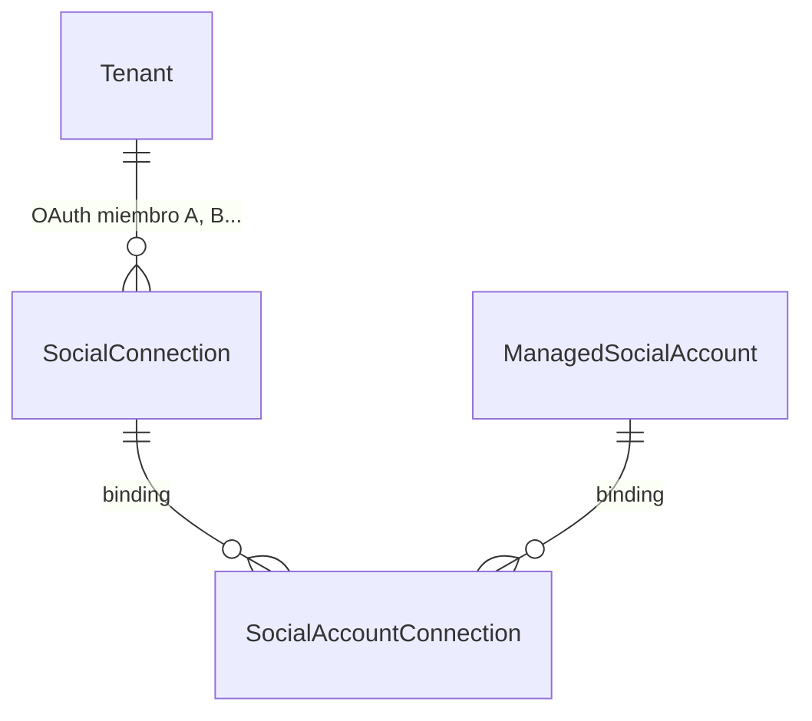

# Guía frontend: Multi-OAuth por tenant (LinkedIn)

Documento para el equipo frontend con el flujo backend implementado: varias cuentas LinkedIn OAuth (`SocialConnection`) por tenant en `linkedin_oauth`, sync automático de **perfil personal** y **organizaciones** administradas, bindings cuenta↔conexión (`SocialAccountConnection`), disconnect scoped y publish por binding.

**Referencia técnica backend:** [`docs/Documentos requerimientos/plan-multi-oauth-linkedin-por-tenant.md`](Documentos%20requerimientos/plan-multi-oauth-linkedin-por-tenant.md)  
**Paridad de patrón:** [`docs/frontend-multi-oauth-facebook-por-tenant.md`](frontend-multi-oauth-facebook-por-tenant.md)  
**Catálogo HTTP general:** [`docs/endpoints-redes-sociales-meta-facebook-linkedin.md`](endpoints-redes-sociales-meta-facebook-linkedin.md)

**Rutas SPA sugeridas:**
- `/dashboard/cuentas-conectadas/linkedin` — listado conexiones y cuentas conectadas
- `/dashboard/cuentas-conectadas/linkedin/select?connectionId={id}` — selector post-OAuth

---

## 1. Objetivo funcional

Permitir que un mismo tenant (caso agencia) conecte **varios miembros LinkedIn** (clientes distintos). Cada OAuth:

1. Importa el **perfil personal** del miembro (`accountType: profile`) — disponible hoy con *Share on LinkedIn* (`w_member_social`).
2. Importa las **organizaciones** administradas (`accountType: organization`) — cuando la app tenga CM API aprobada.

Tras OAuth, las cuentas quedan en estado **`Discovered`** hasta que el usuario las **conecte en el selector** (paridad Facebook). Ver [`docs/frontend-seleccion-organizaciones-linkedin-post-oauth.md`](frontend-seleccion-organizaciones-linkedin-post-oauth.md).

El frontend debe poder:

- Redirigir al **selector** post-OAuth (`/linkedin/select?connectionId=`).
- Mostrar **cuántas conexiones OAuth** hay y **cuántas cuentas conectadas vs disponibles**.
- Diferenciar visualmente **perfil personal** vs **página de empresa**.
- **Añadir** otro miembro (`mode=add`).
- **Reautenticar** una conexión concreta (`mode=reauth&connectionId=`).
- **Sincronizar** o **desconectar** una conexión específica sin afectar cuentas que sigan accesibles vía otro binding.
- Mostrar cada conexión como tarjeta con `displayLabel` (nombre del miembro).
- Indicar orgs **compartidas** entre varios miembros (varios bindings, una fila de cuenta).

**Fuera de alcance en UI legacy:** rutas `/api/linkedin/*` en pantallas nuevas.

**Selector post-OAuth:** implementado — ver guía dedicada [`frontend-seleccion-organizaciones-linkedin-post-oauth.md`](frontend-seleccion-organizaciones-linkedin-post-oauth.md).

---

## 2. Productos LinkedIn y fases

| Fase | Producto LinkedIn | Scopes OAuth | Qué importa el sync |
|------|-------------------|--------------|---------------------|
| **Actual** | Sign In with LinkedIn (OpenID) + Share on LinkedIn | `openid profile email w_member_social` | 1 cuenta `profile` por miembro conectado |
| **Futura** | Community Management API | `+ w_organization_social rw_organization_admin` | Orgs administradas (`organization`) además del perfil |

**Config backend actual** (`appsettings`):

```json
"linkedin_oauth": {
  "Scopes": "openid profile email w_member_social"
}
```

Cuando LinkedIn apruebe CM API, el backend ampliará scopes a:

```text
openid profile email w_member_social w_organization_social rw_organization_admin
```

---

## 3. Modelo conceptual para la UI



| Concepto | Qué representa en UI | `accountType` | Ejemplo |
|----------|----------------------|---------------|---------|
| **SocialConnection** | Sesión OAuth de un miembro LinkedIn | — | Tarjeta `Cliente A`, `externalUserId: abc123` |
| **ManagedSocialAccount (perfil)** | Perfil personal publicable del miembro | `profile` | `Juan Pérez` — publicar como persona |
| **ManagedSocialAccount (org)** | Página de empresa publicable | `organization` | `Acme Corp`, `externalAccountId: org-1001` |
| **SocialAccountConnection** | Enlace cuenta ↔ conexión (sin token propio) | — | Misma org visible desde 2 conexiones si ambos miembros la administran |

**Regla de token:** el token de publicación **solo** vive en `SocialConnection.EncryptedAccessToken`. Los bindings y las cuentas **no** almacenan token de miembro.

**Regla de disconnect:** al desconectar la **conexión A**, solo se revocan bindings de A. Si la cuenta (org o perfil) tiene otro binding activo (conexión B), **sigue activa** y la cuenta primaria pasa a B.

**Regla 1:1 perfil–miembro:** cada miembro OAuth genera **como máximo una** cuenta `profile` identificada por su `externalUserId` (sub OpenID). Reconectar el mismo miembro actualiza la misma cuenta.

---

## 4. Capacidades de publicación por tipo de cuenta

Usar `capabilities` y `canPublish` del DTO de cuenta para habilitar/deshabilitar tipos de post en el composer.

| Tipo de contenido | `profile` (perfil personal) | `organization` (página empresa) |
|-------------------|----------------------------|--------------------------------|
| Texto | Sí | Sí |
| Imagen | Sí | Sí |
| Artículo / enlace | Sí | Sí |
| Documento PDF | **No** | Sí |
| Multi-imagen (carrusel) | **No** | Sí |

Si el usuario elige una cuenta `profile` en el composer, **ocultar** opciones PDF y multi-imagen. El backend rechazará esos tipos con `LINKEDIN_CAPABILITY_*` si se envían igualmente.

---

## 5. Qué cambió respecto al comportamiento anterior

| Antes (Fase 1) | Ahora (`linkedin_oauth` multi) |
|----------------|--------------------------------|
| Un solo OAuth LinkedIn activo | Varios OAuth activos si `AllowMultipleConnectionsPerTenant: true` |
| Solo organizaciones | **Perfil personal** + organizaciones (orgs cuando CM API esté aprobada) |
| Token implícito vía `SocialConnectionId` en cuenta | Publish resuelve **mejor binding** → token de la conexión elegida |
| Disconnect global por conexión | Disconnect **scoped** por cuenta/bindings |
| Status vía `GET /api/linkedin/status` | Status canónico vía integraciones sociales |
| Sin `displayLabel` en conexión | `displayLabel` = nombre del miembro |
| Límite orgs en sync | Límite orgs **al conectar** en selector; sync importa todas |
| Cuentas activas tras OAuth | Import `Discovered`; conectar vía `/accounts/connect` |

---

## 6. Headers comunes

```http
Authorization: Bearer <jwt>
X-Tenant-Id: <tenantIdActivo>
```

Política: `TenantMember` (callback OAuth anónimo).

Formato: `{ "data": { ... } }` en `camelCase`.

---

## 7. Endpoints (`linkedin_oauth`)

| Acción | Método | Ruta |
|--------|--------|------|
| Status canónico | `GET` | `/api/social/integrations/linkedin/linkedin_oauth/status` |
| Listar conexiones | `GET` | `/api/social/connections?connectionType=linkedin_oauth` |
| Detalle conexión | `GET` | `/api/social/connections/{connectionId}` |
| Iniciar OAuth (add) | `GET` | `/api/social/connect/linkedin/linkedin_oauth/start?mode=add` |
| Iniciar OAuth (reauth) | `GET` | `/api/social/connect/linkedin/linkedin_oauth/start?mode=reauth&connectionId={id}` |
| Callback OAuth | `GET` | `/api/social/connect/linkedin/linkedin_oauth/callback?code=&state=` |
| Sync scoped | `POST` | `/api/social/connections/{connectionId}/sync` |
| Disconnect scoped | `POST` | `/api/social/connections/{connectionId}/disconnect` |
| Cuentas + bindings | `GET` | `/api/social/accounts?providerGroup=linkedin&includeBindings=true` |
| Cuentas publicables | `GET` | `/api/social/accounts?providerGroup=linkedin&forPublishing=true` |
| Selector (disponibles) | `GET` | `/api/social/connections/{connectionId}/accounts?status=available` |
| Conectar cuenta | `POST` | `/api/social/accounts/{accountId}/connect` |
| Conectar bulk | `POST` | `/api/social/accounts/connect` |
| Desconectar cuenta | `POST` | `/api/social/accounts/{accountId}/disconnect` |

### 7.1 Status canónico (usar en pantalla principal)

```http
GET /api/social/integrations/linkedin/linkedin_oauth/status
```

Campos relevantes en `data`:

| Campo | Uso en UI |
|-------|-----------|
| `connectionCount` | Número de conexiones OAuth activas |
| `allowMultipleConnectionsPerTenant` | Si mostrar botón "Añadir otro miembro" |
| `remainingConnections` | Cupo restante de conexiones |
| `maxLinkedInOrganizations` | Límite de orgs del plan (no aplica al perfil personal) |
| `activeLinkedInOrganizations` | Orgs **conectadas** al workspace (`Connected`) |
| `remainingLinkedInOrganizations` | Cupo restante de orgs |
| `requiresReconnect` | Banner global de reconexión |
| `warningCode` / `warningMessage` | Avisos de sync (p. ej. sin orgs pero con perfil OK) |

**Conteo de cuentas publicables:** usar `GET /api/social/accounts?providerGroup=linkedin&forPublishing=true` — solo `Connected`. Tras OAuth sin selector, la lista estará vacía hasta conectar.

Cada conexión en `GET /api/social/connections` incluye `activeAccountCount`, `discoveredAccountCount`, `totalAccountCount` (perfil + orgs de esa conexión).

**No usar** `GET /api/linkedin/status` en UI nueva — no expone `connectionCount` ni cupos multi-OAuth.

### 7.2 Listado de conexiones

```http
GET /api/social/connections?connectionType=linkedin_oauth
```

Cada item incluye `id`, `displayLabel`, `externalUserId`, `tokenStatus`, `isActive`, `lastSyncAt`, `lastSyncStatus`.

### 7.3 Listado de cuentas publicables

```http
GET /api/social/accounts?providerGroup=linkedin&includeBindings=true
```

Campos clave por cuenta:

| Campo | Uso |
|-------|-----|
| `accountType` | `profile` → badge "Perfil personal"; `organization` → badge "Página de empresa" |
| `displayName` | Nombre visible en selector de destino al publicar |
| `canPublish` | Si aparece en composer / calendario |
| `canPublishReason` | Motivo si no publicable (`inactive`, `token_invalid`, `capability_missing`, …) |
| `capabilities` | Qué tipos de post admite (ver §4) |
| `connectionBindings` | Miembros OAuth vinculados (orgs compartidas) |

**Ejemplo — solo perfil (fase actual sin CM API):**

```json
{
  "data": [
    {
      "id": 101,
      "provider": "linkedin",
      "accountType": "profile",
      "externalAccountId": "abc123",
      "displayName": "Juan Pérez",
      "canPublish": true,
      "capabilities": {
        "canPublishText": true,
        "canPublishImage": true,
        "canPublishArticle": true,
        "canPublishDocument": false,
        "canPublishMultiImage": false
      },
      "connectionBindings": [
        { "socialConnectionId": 42, "isActive": true, "isPreferredForPublishing": true }
      ]
    }
  ]
}
```

### 7.4 Callback OAuth y redirects

Config backend (`appsettings`):

```json
"linkedin_oauth": {
  "AutoActivateOrganizationsOnSync": false,
  "AllowMultipleConnectionsPerTenant": true,
  "FrontendOAuthSuccessRedirectPath": "/dashboard/cuentas-conectadas/linkedin/select?connectionId={connectionId}",
  "FrontendOAuthErrorRedirectPath": "/dashboard/cuentas-conectadas/linkedin?liError={errorCode}"
}
```

Tras callback exitoso, la SPA debe:

1. Redirigir o permanecer en **selector** (`/linkedin/select?connectionId=`).
2. Leer query string: `connectionId`, `accountsImported`, `warning` (opcional).
3. `GET /connections/{id}/accounts?status=available` — perfil + orgs con checkbox.
4. `POST /accounts/connect` (bulk) para conectar selección.
5. Refrescar status, conexiones y `forPublishing=true`.

Para pruebas/API: añadir `responseMode=json` al callback para respuesta JSON en lugar de redirect.

**Redirect éxito típico (solo perfil, sin CM API):**

```text
/dashboard/cuentas-conectadas/linkedin?connectionId=42&accountsImported=1&warning=LINKEDIN_NO_ADMIN_ORGANIZATIONS
```

**Redirect éxito (perfil + orgs, fase futura):**

```text
/dashboard/cuentas-conectadas/linkedin?connectionId=42&accountsImported=4
```

Fragmento de callback JSON:

```json
{
  "data": {
    "connectionId": 42,
    "accountsImported": 1,
    "errors": 0,
    "warningCode": "LINKEDIN_NO_ADMIN_ORGANIZATIONS",
    "message": "Conexión exitosa; cuentas disponibles para conectar en el selector.",
    "organizationErrors": []
  }
}
```

### 7.5 Mensajes UX tras OAuth

| Situación | `accountsImported` | `warningCode` | Toast sugerido |
|-----------|-------------------|---------------|----------------|
| Perfil OK, sin orgs (fase actual) | `≥ 1` | `LINKEDIN_NO_ADMIN_ORGANIZATIONS` | "LinkedIn conectado. Selecciona el perfil para publicar. Las páginas de empresa aparecerán cuando LinkedIn apruebe la app." |
| Perfil + orgs importadas (discovered) | `≥ 2` | — | "Se encontraron X cuentas. Elige cuáles conectar al workspace." |
| Límite orgs al conectar | — | — | `409 SOCIAL_ACCOUNT_LIMIT_REACHED` en connect |
| Error OAuth | — | `liError=...` en query | Ver §9 |

---

## 8. Flujos UX recomendados

### 8.1 Conectar primer miembro

1. `GET .../start?mode=add` → redirect a LinkedIn.
2. Callback → redirect SPA al **selector** con `connectionId`.
3. `GET /connections/{id}/accounts?status=available` — marcar perfil (y orgs si existen).
4. `POST /accounts/connect` — conectar selección.
5. Refrescar `forPublishing=true` y listado de conexiones.

### 8.2 Añadir segundo miembro (agencia)

1. Verificar `remainingConnections > 0`.
2. `GET .../start?mode=add`.
3. Tras callback, `connectionCount` incrementa; aparece otro `profile` y, si hay CM API, orgs/bindings adicionales.

### 8.3 Reautenticar conexión expirada

1. Usuario elige tarjeta de conexión con `requiresReconnect` o `tokenStatus != Valid`.
2. `GET .../start?mode=reauth&connectionId={id}`.
3. **Importante:** LinkedIn debe devolver el **mismo** miembro; mismatch → `409 SOCIAL_CONNECTION_REAUTH_USER_MISMATCH`.

### 8.4 Desconectar miembro

1. `POST /api/social/connections/{connectionId}/disconnect`.
2. Refrescar cuentas:
   - Su **perfil** (`profile`) queda inactivo si no hay otro binding.
   - Orgs exclusivas de ese miembro → `isActive: false`.
   - Orgs compartidas pueden seguir activas vía otro binding.

### 8.5 Org compartida (badge)

Si `includeBindings=true` y una cuenta `organization` tiene `connectionBindings.length > 1`, mostrar badge "Acceso compartido" y listar miembros vinculados.

### 8.6 Publicar (composer / calendario)

1. Cargar cuentas con `canPublish: true`.
2. Mostrar agrupado o con icono:
   - **Perfil personal** — `accountType === 'profile'`
   - **Página de empresa** — `accountType === 'organization'`
3. Al seleccionar destino, pasar `managedSocialAccountId` a `POST /api/social/post-plans` (sin cambios en contrato).
4. Respetar `capabilities` del DTO (§4).

---

## 9. Errores y límites

| Código | HTTP | Cuándo | Mensaje sugerido |
|--------|------|--------|------------------|
| `SOCIAL_CONNECTION_LIMIT_REACHED` | 409 | OAuth add supera cupo conexiones | "Has alcanzado el límite de miembros LinkedIn conectados." |
| `LINKEDIN_ORGANIZATION_LIMIT_REACHED` | 409 (en connect) | Conectar org supera cupo | "Has alcanzado el límite de páginas de empresa LinkedIn." |
| `SOCIAL_CONNECTION_REAUTH_USER_MISMATCH` | 409 | Reauth con otro usuario LinkedIn | "Debes iniciar sesión con la misma cuenta LinkedIn." |
| `LINKEDIN_NO_ADMIN_ORGANIZATIONS` | — (warning) | Sin orgs administradas | "No hay páginas de empresa. Puedes publicar en el perfil personal conectado." |
| `LINKEDIN_AUTH_REVOKED` | — (`liError`) | Token inválido / OAuth falló | "La sesión de LinkedIn expiró. Vuelve a conectar." |
| `LINKEDIN_CAPABILITY_*` | 400 | Tipo de post no admitido en perfil | "Este tipo de publicación no está disponible para perfiles personales." |

**Reauth al límite de conexiones:** debe **succeed** (no devolver `SOCIAL_CONNECTION_LIMIT_REACHED`) porque no crea conexión nueva.

**Nota sobre `LINKEDIN_NO_ADMIN_ORGANIZATIONS`:** con la fase actual (solo `w_member_social`) es **esperado** y compatible con `accountsImported >= 1`. No tratarlo como error bloqueante.

---

## 10. Layout de pantalla sugerido

```text
┌─────────────────────────────────────────────────────────┐
│  LinkedIn                          [+ Conectar miembro] │
├─────────────────────────────────────────────────────────┤
│  Conexiones OAuth (tarjetas)                            │
│  ┌──────────────┐  ┌──────────────┐                     │
│  │ Juan Pérez   │  │ Cliente B    │                     │
│  │ Reauth Sync  │  │ ...          │                     │
│  └──────────────┘  └──────────────┘                     │
├─────────────────────────────────────────────────────────┤
│  Cuentas publicables                                    │
│  • Juan Pérez          [Perfil personal]   canPublish ✓ │
│  • Acme Corp           [Página empresa]    canPublish ✓ │  ← futuro CM API
│  • Org compartida      [Página empresa]    🔗 2 miembros│
└─────────────────────────────────────────────────────────┘
```

---

## 11. Diferencias vs Facebook / Instagram

| Aspecto | Facebook | Instagram | LinkedIn |
|---------|----------|-----------|----------|
| Recursos por OAuth | N páginas | 1 cuenta IG | 1 perfil + N orgs |
| Tipos de cuenta | `page` | `business` | `profile`, `organization` |
| Bindings | Sí (page token) | Fase 3 futura | Sí (sin token en binding) |
| Token publish | Binding / page | Conexión IG | Conexión miembro vía binding |
| Selector post-OAuth | Sí (páginas) | No | **Sí** (perfil + orgs) |
| Status canónico | `.../facebook_login/status` | `.../instagram_login/status` | `.../linkedin_oauth/status` |

---

## 12. Checklist frontend

- [x] Pantalla en hub `/dashboard/cuentas-conectadas` usa **status canónico** §7.1 (alias `/linkedin` para errores OAuth).
- [x] Lista conexiones con `displayLabel` y acciones sync/disconnect/reauth por `connectionId`.
- [x] Botón "Conectar otro miembro" condicionado a `allowMultipleConnectionsPerTenant` y `remainingConnections`.
- [x] Listado cuentas distingue `accountType: profile` vs `organization` (badges §7.3).
- [ ] Composer respeta `capabilities` — sin PDF/multi-imagen en `profile` (§4).
- [x] Pantalla selector en `/dashboard/cuentas-conectadas/linkedin/select` (guía dedicada).
- [x] Tras OAuth: selector → bulk connect → `forPublishing=true`.
- [x] No usar `PATCH /status` para `profile`/`organization` (usar connect/disconnect).
- [x] `activeAccountCount=0` tras OAuth es normal (`discoveredAccountCount` > 0).
- [x] Redirects `connectionId`, `accountsImported`, `warning`, `liError` en query string.
- [x] No consumir `GET /api/linkedin/status` en flujos nuevos.
- [x] Publicación (`POST /api/social/post-plans`) sin cambios — usa `managedSocialAccountId` con `canPublish: true`.

---

## 13. Deprecación legacy

| Legacy | Reemplazo |
|--------|-----------|
| `GET /api/linkedin/status` | `GET /api/social/integrations/linkedin/linkedin_oauth/status` |
| `GET /api/linkedin/connect/start` | `GET /api/social/connect/linkedin/linkedin_oauth/start?mode=add` |
| Disconnect/sync global legacy | `POST /api/social/connections/{id}/disconnect` / `sync` |

Mantener compatibilidad temporal; migrar pantallas existentes al modelo social-first.
