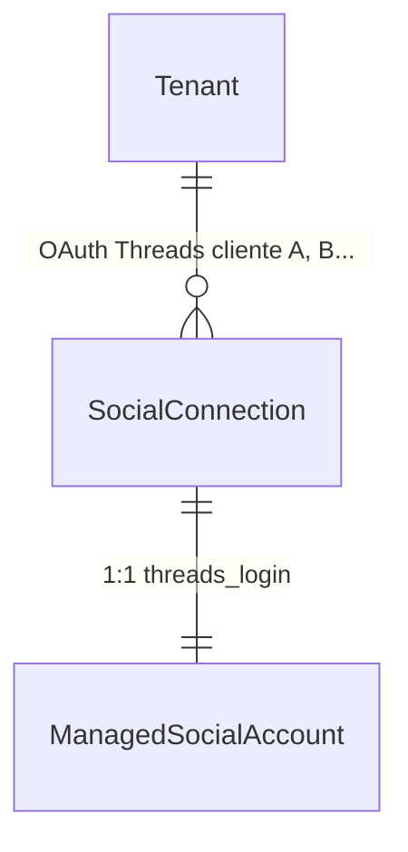
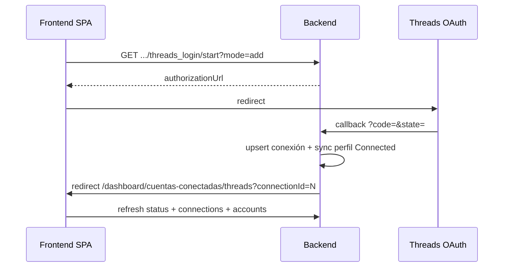

# Guía frontend: Multi-OAuth por tenant (Threads Login)

Documento para el equipo frontend con el flujo backend implementado: varias cuentas Threads OAuth (`SocialConnection`) por tenant en `threads_login`, gestión por conexión (sync/disconnect/reauth) y **1 conexión = 1 perfil Threads** publicable.

**Referencia técnica backend:** [`docs/Documentos requerimientos/plan-threads-por-tenant.md`](Documentos%20requerimientos/plan-threads-por-tenant.md)  
**Paridad de patrón:** [`docs/frontend-multi-oauth-instagram-por-tenant.md`](frontend-multi-oauth-instagram-por-tenant.md)  
**Catálogo HTTP general:** [`docs/endpoints-redes-sociales-meta-facebook-linkedin.md`](endpoints-redes-sociales-meta-facebook-linkedin.md)

**Ruta SPA sugerida:** `/dashboard/cuentas-conectadas/threads`

---

## 1. Objetivo funcional

Permitir que un mismo tenant (caso agencia) conecte **varios clientes Threads** mediante Threads Login: **1 OAuth = 1 perfil**, **sin** pantalla de selección post-OAuth.

El frontend debe poder:

- Mostrar **cuántas conexiones OAuth** y **cuántos perfiles Threads activos** hay.
- **Añadir** otro cliente (`mode=add`).
- **Reautenticar** una conexión concreta (`mode=reauth&connectionId=`).
- **Sincronizar** o **desconectar** una conexión específica sin afectar las demás.
- Mostrar cada conexión como tarjeta con `displayLabel` (`@username`).

**Threads es red independiente de Instagram** en DataColor (`provider=threads`, `connectionType=threads_login`). No mezclar con la pantalla de Instagram.

---

## 2. Modelo conceptual para la UI



| Concepto | Qué representa en UI | Ejemplo |
|----------|----------------------|---------|
| **SocialConnection** | Sesión OAuth de un usuario Threads | Tarjeta `@marca_cliente_a` |
| **ManagedSocialAccount** | Perfil publicable (misma identidad) | Mismo `@marca_cliente_a` en composer |

**Regla de identidad:** `SocialConnection.ExternalUserId === ManagedSocialAccount.ExternalAccountId`.

**No aplica en v1:** selector post-OAuth, `SocialAccountConnection`, bindings N:M.

---

## 3. Headers comunes

```http
Authorization: Bearer <jwt>
X-Tenant-Id: <tenantIdActivo>
```

Formato: `{ "data": { ... } }` en `camelCase`.

---

## 4. Endpoints (`threads_login`)

| Acción | Método | Ruta |
|--------|--------|------|
| Status | `GET` | `/api/social/integrations/meta/threads_login/status` |
| Listar conexiones | `GET` | `/api/social/connections?connectionType=threads_login` |
| Detalle conexión | `GET` | `/api/social/connections/{connectionId}` |
| Iniciar OAuth (add) | `GET` | `/api/social/connect/meta/threads_login/start?mode=add` |
| Iniciar OAuth (reauth) | `GET` | `/api/social/connect/meta/threads_login/start?mode=reauth&connectionId={id}` |
| Callback OAuth | `GET` | `/api/social/connect/meta/threads_login/callback` |
| Sync scoped | `POST` | `/api/social/connections/{connectionId}/sync` |
| Disconnect scoped | `POST` | `/api/social/connections/{connectionId}/disconnect` |
| Cuentas Threads | `GET` | `/api/social/accounts?provider=threads` |
| Publicables | `GET` | `/api/social/accounts?provider=threads&forPublishing=true` |
| Publicar | `POST` | `/api/social/post-plans` |

### 4.1 Status — campos relevantes

```json
{
  "data": {
    "providerGroup": "meta",
    "connectionType": "threads_login",
    "connected": true,
    "connectionCount": 3,
    "allowMultipleConnectionsPerTenant": true,
    "maxConnectionsPerTenant": 5,
    "remainingConnections": 2,
    "maxThreadsAccounts": 5,
    "activeThreadsAccounts": 3,
    "remainingThreadsAccounts": 2,
    "totalAccounts": 3,
    "activeAccounts": 3,
    "requiresReconnect": false
  }
}
```

| Campo | Uso en UI |
|-------|-----------|
| `connectionCount` / `maxConnectionsPerTenant` / `remainingConnections` | Badge OAuth “3/5 conexiones Threads” |
| `activeThreadsAccounts` / `maxThreadsAccounts` / `remainingThreadsAccounts` | Badge plan “3/5 perfiles publicables” |
| `allowMultipleConnectionsPerTenant` | Mostrar “Conectar otro perfil” |

### 4.2 Regla para deshabilitar “Conectar Threads”

```text
canAddThreads =
  allowMultipleConnectionsPerTenant == true
  AND (remainingConnections == null OR remainingConnections > 0)
  AND (remainingThreadsAccounts == null OR remainingThreadsAccounts > 0)
```

Si `remainingConnections <= 0` → toast “Límite de conexiones Threads alcanzado”.  
Si `remainingThreadsAccounts <= 0` → toast “Límite de cuentas Threads activas alcanzado”.

Evaluar **ambos** ejes aunque en planes agencia suelen ser el mismo N.

---

## 5. Flujo OAuth (sin selector)



**Redirect éxito:** `/dashboard/cuentas-conectadas/threads?connectionId={connectionId}`  
**Redirect error:** `/dashboard/cuentas-conectadas/threads?threadsError={errorCode}`

Tras callback: toast “Perfil conectado” + refresh listas. **No** hay pantalla selector.

| `mode` | `connectionId` | Comportamiento |
|--------|----------------|----------------|
| `add` | — | Nueva conexión o upsert; evalúa límites condicionales |
| `reauth` | obligatorio | Renueva token; **no** evalúa límites; mismo `threads_user_id` |

---

## 6. Errores a manejar en UI

| `errorCode` | HTTP | Mensaje sugerido |
|-------------|------|------------------|
| `SOCIAL_CONNECTION_LIMIT_REACHED` | 409 | Límite de conexiones OAuth alcanzado |
| `SOCIAL_THREADS_ACCOUNT_LIMIT_REACHED` | 409 | Límite de perfiles Threads activos alcanzado |
| `SOCIAL_CONNECTION_REAUTH_USER_MISMATCH` | 409 | Iniciaste sesión con otra cuenta Threads |
| `SOCIAL_CONNECTION_REAUTH_REQUIRED` | 409 | Indica qué conexión reautenticar |
| `SOCIAL_CONNECTION_NOT_FOUND` | 404 | La conexión ya no existe |

**Precedencia en `mode=add`:** primero cupo conexión (solo `threads_user_id` nuevo), luego cupo cuenta (solo si `WouldConsumeNewThreadsSlot`).

---

## 7. Disconnect y workspace

`POST /connections/{id}/disconnect` **revoca OAuth** → cuenta afectada queda `WorkspaceStatus=Revoked` (no `Disabled`).

Otras conexiones Threads del tenant **no** se ven afectadas (multi-OAuth).

---

## 8. Composer / publicación

- Destinos: cuentas con `provider=threads` y `forPublishing=true`.
- MVP: texto e imagen vía `POST /api/social/post-plans`.
- Capabilities: `canPublishImage` (incluye texto-only cuando no hay media).

---

## 9. Diferencias vs Instagram

| Aspecto | Instagram | Threads |
|---------|-----------|---------|
| `connectionType` | `instagram_login` | `threads_login` |
| `provider` | `instagram` | `threads` |
| Host API | `graph.instagram.com` | `graph.threads.net` |
| Dual-path FB | Posible | **No** en v1 |
| Status cupos | `maxInstagramAccounts` | `maxThreadsAccounts` |
| Query error OAuth | `?igError=` | `?threadsError=` |

Misma persona puede tener **dos filas** independientes (IG + Threads) en el tenant.

---

## 10. Checklist frontend

- [x] Ruta `/dashboard/cuentas-conectadas/threads`
- [x] Status con cupos explícitos Threads
- [x] Tarjetas conexión con `displayLabel`
- [x] OAuth add/reauth; manejar `?connectionId=` y `?threadsError=`
- [x] **Sin** selector post-OAuth
- [x] Sync/disconnect scoped por `connectionId`
- [x] Deshabilitar “Conectar” según `canAddThreads`
- [x] Errores de límites y reauth mismatch
- [ ] Composer: destinos `provider=threads` _(pendiente — fuera de alcance v1)_

---

**Última revisión:** 1 julio 2026  
**Estado backend:** Implementado — `threads_login` multi-OAuth por tenant
