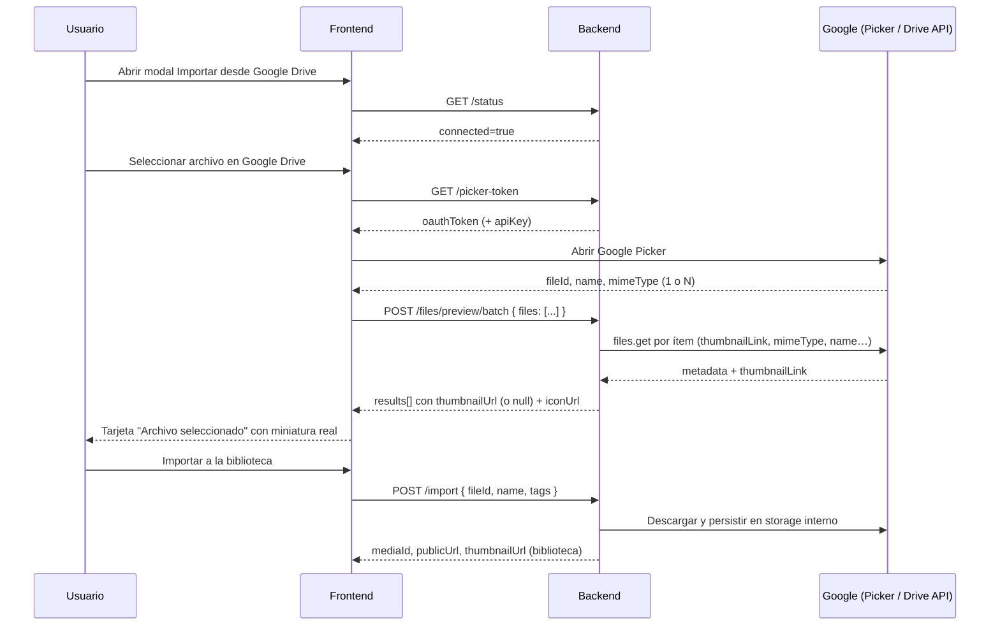

# Google Drive: necesidad de preview en backend (Nivel 3)

Documento técnico que justifica por qué la miniatura del archivo seleccionado en el modal de importación de Google Drive debe resolverse con un **endpoint en backend**, y no solo con datos del Picker ni con llamadas directas a Drive API desde el frontend.

---

## 1. Contexto actual

En el gestor de archivos, tras elegir un archivo con Google Picker, el modal muestra una tarjeta **“Archivo seleccionado”**. Hoy el bloque visual usa un placeholder fijo:

```html
<div class="selected-file-thumb">GD</div>
```

Ese bloque aparece cuando `integrationFileId` tiene valor, es decir, después de que el usuario elige un archivo en el Picker y antes de pulsar **“Importar a la biblioteca”**.

El flujo principal de importación **sí funciona** y no depende de la miniatura:

1. `GET /api/integrations/google-drive/status`
2. `GET /api/integrations/google-drive/oauth/start` (si no hay conexión)
3. `GET /api/integrations/google-drive/picker-token`
4. Google Picker (selección visual)
5. `POST /api/integrations/google-drive/import`

La miniatura es un requisito de **UX de confirmación**, no de importación. Aun así, mostrar solo “GD” degrada la confianza del usuario: no puede verificar visualmente que eligió el archivo correcto antes de importarlo.

---

## 2. Problema de negocio

| Sin preview real | Con preview real |
|------------------|------------------|
| El usuario confía solo en el nombre de archivo (texto) | El usuario ve una representación visual del activo |
| Más riesgo de importar el archivo equivocado | Menos errores operativos en campañas y publicaciones |
| La UI parece incompleta o provisional | La experiencia se alinea con el resto del gestor (grid con `thumbnailUrl`) |
| No hay paridad con importación local o por URL (que sí muestran preview) | Flujo homogéneo entre fuentes de media |

En un producto de publicación social, importar el asset incorrecto tiene coste real: reprocesar creatividades, rehacer posts o publicar contenido erróneo.

---

## 3. Por qué el Picker no resuelve la miniatura (Nivel 1 insuficiente)

Google Picker devuelve un `DocumentObject` con campos como `id`, `name`, `mimeType` e `iconUrl`.

Limitaciones relevantes:

- **`iconUrl`** es un icono genérico del tipo de archivo (PDF, hoja de cálculo, imagen…), no una preview del contenido.
- **`thumbnails`** no se devuelve para archivos alojados en Google Drive; Google documenta explícitamente que ese array aplica a fotos/vídeos fuera de Drive, no a ítems de Drive.
- El servicio frontend actual (`GooglePickerService`) solo persiste `fileId`, `name` y `mimeType`; no expone ni usa `iconUrl`.

Conclusión: usar solo el Picker mejora poco la UX respecto a “GD”. Sigue sin ser una miniatura real.

---

## 4. Por qué no conviene resolverlo solo en frontend (Nivel 2 insuficiente)

Una alternativa es que el frontend, tras la selección, llame directamente a Drive API:

```
GET https://www.googleapis.com/drive/v3/files/{fileId}?fields=thumbnailLink,name,mimeType
Authorization: Bearer {oauthToken}
```

o intente URLs del estilo:

```
https://drive.google.com/thumbnail?id={fileId}&sz=w200
```

### 4.1 Problemas técnicos

| Problema | Detalle |
|----------|---------|
| **Tokens en el cliente** | El token OAuth ya se expone parcialmente vía `picker-token`. Ampliar su uso para más operaciones aumenta superficie de abuso y acopla lógica de integración al SPA. |
| **`` sin auth** | Las URLs de thumbnail de Drive suelen requerir autorización. Un `` no envía `Authorization`, lo que provoca 403 o imágenes rotas. |
| **Workarounds frágiles** | `fetch` + `blob:` en frontend funciona, pero añade complejidad, fugas de memoria si no se revocan blobs, y manejo de CORS/errores duplicado. |
| **Scopes restrictivos** | Con `drive.file` (recomendado para evitar scopes sensibles), las miniaturas en grid del propio Picker y las previews posteriores pueden fallar con 403. |
| **Inconsistencia arquitectónica** | El proyecto ya define OAuth e importación como **backend-first** (ver `GUIA-TECNICA-gestor-de-archivos.md`). Sacar previews por el frontend rompe ese patrón. |

### 4.2 Problemas de producto y operación

- La lógica de permisos, reintentos y mensajes de error quedaría repartida entre frontend y backend.
- Cambios de scopes, rotación de tokens o políticas de Google obligarían tocar el SPA.
- Sería difícil auditar quién accedió a qué archivo de Drive antes de importarlo.

Conclusión: el frontend puede **consumir** una URL de preview; no debe ser el **origen de autoridad** para obtenerla.

---

## 5. Solución recomendada: Nivel 3 (backend como autoridad)

El backend, que ya almacena y renueva tokens OAuth por usuario/tenant, debe exponer un endpoint de **preview/metadata** del archivo seleccionado.

### 5.1 Principios

1. **Misma autoridad que import**: si el usuario puede importar un `fileId`, el backend puede consultar su metadata con el mismo vínculo OAuth.
2. **El frontend no guarda tokens de Google** más allá del uso estricto del Picker.
3. **Contrato estable**: el SPA recibe una URL o un indicador de fallback, no detalles de Drive API.
4. **Seguridad por tenant**: el `fileId` se resuelve siempre en contexto del usuario autenticado y tenant activo.
5. **Degradación controlada**: si no hay thumbnail (PDF, vídeo sin poster, permisos), el backend responde con `thumbnailUrl: null` y el frontend muestra icono por `mimeType`.

### 5.2 Endpoint propuesto

| Aspecto | Detalle |
|---------|---------|
| Método y ruta | `POST /api/integrations/{provider}/files/preview/batch` |
| Auth | JWT requerido |
| Autorización | `TenantMember` |
| Headers | `Authorization: Bearer <jwt>`, `X-Tenant-Id: <tenantId>` |
| Body | `{ "files": [{ "fileId", "driveId?" }] }` — 1 o N archivos (máx. alineado con import batch) |
| Respuesta | `200` con `results[]` por archivo (`ok`, `data` con metadata para la tarjeta) |

#### Request de ejemplo

```json
{
  "files": [
    { "fileId": "1A2B3C_example" },
    { "fileId": "9Z8Y7X_example", "driveId": "b!xxxx" }
  ]
}
```

#### Respuesta exitosa (`200`)

```json
{
  "data": {
    "totalRequested": 1,
    "processed": 1,
    "failed": 0,
    "results": [
      {
        "fileId": "1A2B3C_example",
        "ok": true,
        "data": {
          "fileId": "1A2B3C_example",
          "name": "banner-campana-abril.jpg",
          "mimeType": "image/jpeg",
          "thumbnailUrl": "https://lh3.googleusercontent.com/...",
          "iconUrl": "https://drive-thirdparty.googleusercontent.com/...",
          "sizeBytes": 245760,
          "modifiedTime": "2026-06-10T14:22:00Z"
        }
      }
    ]
  }
}
```

#### Campos recomendados

| Campo | Obligatorio | Uso en frontend |
|-------|-------------|-----------------|
| `fileId` | Sí | Validación / trazabilidad |
| `name` | Sí | Título en tarjeta (puede reforzar lo del Picker) |
| `mimeType` | Sí | Subtítulo y fallback de icono |
| `thumbnailUrl` | No | `` si existe; si es `null`, usar fallback |
| `iconUrl` | No | Fallback mejor que “GD” cuando no hay preview real |
| `sizeBytes` | No | Detalle opcional en UI |
| `modifiedTime` | No | Detalle opcional en UI |

#### Errores esperados

| HTTP | `code` sugerido | Cuándo |
|------|-----------------|--------|
| `401` | — | JWT inválido o expirado |
| `403` | `INTEGRATION_FORBIDDEN` | Sin acceso al archivo con el token actual |
| `404` | `DRIVE_FILE_NOT_FOUND` | `fileId` inexistente o no accesible |
| `412` | `INTEGRATION_NOT_CONNECTED` | Cuenta Drive no conectada |
| `502` | `DRIVE_UPSTREAM_ERROR` | Fallo al consultar Google |

---

## 6. Flujo objetivo (Picker + preview + import)



---

## 7. Implementación backend (orientación)

### 7.1 Responsabilidades

1. Verificar JWT, tenant y conexión activa con Google Drive.
2. Obtener access token vigente del usuario (misma fuente que `import` y `picker-token`).
3. Llamar a Drive API v3, por ejemplo:
   ```
   GET https://www.googleapis.com/drive/v3/files/{fileId}
     ?fields=id,name,mimeType,thumbnailLink,iconLink,size,modifiedTime
   ```
4. Normalizar respuesta al DTO del endpoint.
5. No persistir el archivo en storage interno; eso sigue siendo responsabilidad de `POST /import`.

### 7.2 Reglas de negocio

- Solo permitir preview de archivos que el usuario **ya seleccionó** o que el backend puede resolver con el scope OAuth actual.
- No exponer el access token de Google al frontend en este endpoint.
- Si `thumbnailLink` viene vacío, devolver `thumbnailUrl: null` y preferir `iconLink` como `iconUrl`.
- Cache opcional de corta duración (30–120 s) por `fileId`+usuario para evitar llamadas repetidas si el usuario pulsa “Cambiar archivo” y vuelve al mismo ítem.

### 7.3 Relación con endpoints existentes

| Endpoint existente | Relación |
|--------------------|----------|
| `GET .../picker-token` | Sigue entregando token solo para abrir Picker |
| `POST .../import/batch` | Importación múltiple a biblioteca |
| `POST .../files/preview/batch` | Metadata y miniatura post-selección (1 o N archivos) |

---

## 8. Implementación frontend (orientación)

Tras seleccionar archivos en el picker (`applyPickedIntegrationFiles` en `gestor-archivos.component.ts`):

1. Guardar `fileId`, `driveId?`, `name`, `mimeType` del Picker.
2. Llamar `POST /api/integrations/{provider}/files/preview/batch` con todos los ítems seleccionados.
3. Por cada `result` con `ok: true`, usar `data.thumbnailUrl ?? data.iconUrl` (Google) o fetch+blob vía `/thumbnail` (OneDrive).
4. En el HTML, mostrar miniatura en tarjeta (1 archivo) o lista (N archivos); fallback badge por proveedor.
5. Limpiar `objectURL` al cerrar modal, desconectar o tras importar con éxito.

### Servicio

En `ComposerMediaService`:

```typescript
getIntegrationFilePreviewBatch(
  provider: string,
  body: { files: Array<{ fileId: string; driveId?: string }> }
): Observable<ApiResponse<IntegrationFilePreviewBatchResultDto>>
```

---

## 9. Criterios de aceptación

- [ ] Tras seleccionar una **imagen** en Picker, el modal muestra miniatura real antes de importar (1 o N archivos vía batch).
- [ ] Tras seleccionar un **PDF / documento** sin preview, se muestra `iconUrl` o fallback por tipo (no solo “GD”).
- [ ] Si Drive devuelve 403/404, la UI no rompe el flujo: se mantiene nombre + mimeType y un fallback visual.
- [ ] La importación con `POST /import` sigue funcionando igual que antes.
- [ ] No se añaden tokens de Google al `localStorage` ni se amplía su uso más allá de Picker.
- [ ] El endpoint exige JWT + `X-Tenant-Id` y respeta aislamiento por tenant.
- [ ] No aparece en Network `GET .../files/{fileId}/preview` (endpoint retirado); solo `POST .../files/preview/batch`.

---

## 10. Alternativas descartadas y por qué

| Alternativa | Motivo de descarte |
|-------------|-------------------|
| Mantener “GD” | No aporta confirmación visual; UX provisional |
| Solo `iconUrl` del Picker (Nivel 1) | No es miniatura real; mejora mínima |
| Drive API directa desde frontend (Nivel 2) | Rompe backend-first, frágil con scopes y `` |
| Listado `GET .../files` con grilla propia | Backend no lo implementa; peor UX que Picker; mayor coste de desarrollo |
| Importar primero y mostrar thumbnail de biblioteca | El usuario confirma tarde; no valida antes de importar |

---

## 11. Prioridad sugerida

| Prioridad | Ítem |
|-----------|------|
| P1 | Endpoint `POST .../files/preview/batch` en backend |
| P1 | Consumo en modal de importación Drive (frontend) |
| P2 | Fallback por `mimeType` cuando `thumbnailUrl` sea null |
| P3 | Cache corta en backend para previews repetidas |

Encaja en la fase de integraciones externas del gestor de archivos, después de tener estables `status`, `oauth`, `picker-token` e `import`.

---

## 12. Referencias

- `docs/Gestor de archivos/GUIA-TECNICA-gestor-de-archivos.md` — flujo backend-first con Picker
- `docs/Gestor de archivos/frontend-integracion-google-drive-oauth.md` — OAuth y endpoints actuales
- `docs/Gestor de archivos/POST-api-integrations-provider-import.md` — importación a biblioteca
- [Google Picker — DocumentObject](https://developers.google.com/workspace/drive/picker/reference/picker.documentobject) — limitación de `thumbnails` en Drive
- [Google Drive API v3 — files.get](https://developers.google.com/drive/api/reference/rest/v3/files/get) — `thumbnailLink`, `iconLink`
- Frontend: `src/app/features/media/services/google-picker.service.ts`
- Frontend: `src/app/features/media/components/gestor-archivos/gestor-archivos.component.html` (tarjeta `selected-file-thumb`)
