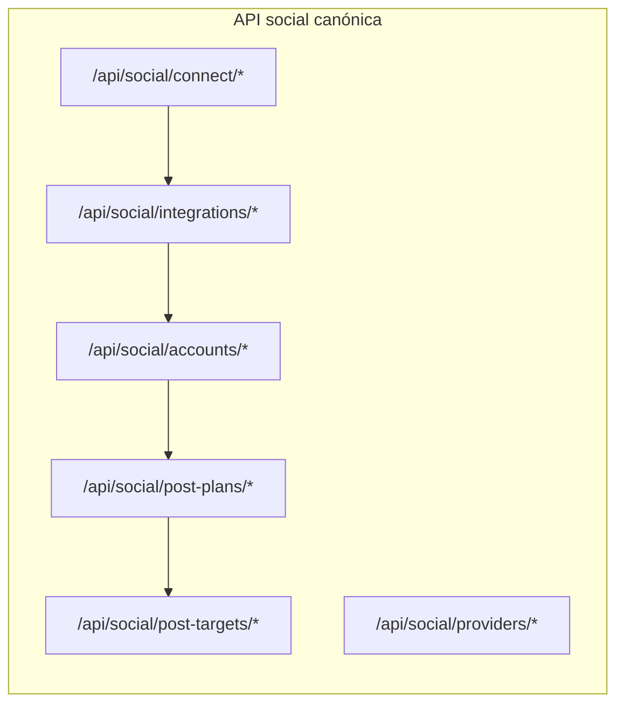

# Catálogo de endpoints — API social (`/api/social/*`)

Referencia HTTP para integraciones sociales (Meta/Facebook, Instagram, LinkedIn) y publicación programada.

**Última revisión:** 26 junio 2026  
**Estado:** Fase 4 completada — API pública social bajo `/api/social/*`  
**Formato de respuesta:** `{ "data": { ... }, "requiresReauth": false }` (`ApiResponse<T>`), JSON en `camelCase`.

> Las rutas legacy (`/api/meta/*`, `/api/linkedin/*`, `/api/facebook/*`, `/api/postplan`, `/api/ag-grid/*`, `/api/targets/resolve`) **fueron eliminadas**. Toda la superficie social vive bajo `/api/social/*` (+ auxiliares `/api/collections` y `/api/media/*/publish-proxy`).

---

## Headers comunes

En endpoints autenticados (salvo callbacks OAuth y proxy de media):

```http
Authorization: Bearer <jwt>
X-Tenant-Id: <tenantId>
```

| Política | Uso |
|----------|-----|
| `TenantMember` | Integración, cuentas, publicación, colecciones |
| `AllowAnonymous` | Callbacks OAuth (`code` + `state` en query) |

---

## Vocabulario (`SocialConstants`)

| Dimensión | Ejemplos | Uso en URL |
|-----------|----------|------------|
| `providerGroup` | `meta`, `linkedin`, `google`, `tiktok`, `x`, `pinterest` | Primer segmento tras `/connect/` o `/integrations/` |
| `connectionType` | `facebook_login`, `instagram_login`, `linkedin_oauth` | Segundo segmento en OAuth y status por flujo |
| `provider` | `facebook`, `instagram`, `linkedin` | Filtro en cuentas, clave en `providerOptions` |
| `accountType` | `page`, `organization`, `business`, … | Filtro en `GET /accounts` |

**MVP conectado hoy:**

| Red | providerGroup | connectionType | provider |
|-----|---------------|----------------|----------|
| Facebook Pages | `meta` | `facebook_login` | `facebook` |
| Instagram | `meta` | `instagram_login` | `instagram` |
| LinkedIn orgs | `linkedin` | `linkedin_oauth` | `linkedin` |

---

## Mapa de arquitectura



| Área | Rol |
|------|-----|
| **Connect** | OAuth unificado (`SocialOAuthSession`) |
| **Integrations** | Catálogo, estado global y por `connectionType` |
| **Accounts** | `ManagedSocialAccount` (FB pages, IG, LinkedIn orgs) |
| **Post plans / targets** | Composer multired y publicación asíncrona |
| **Providers / content-types** | Capabilities y tipos de contenido por red |

**Modelo de datos:** `SocialConnection` → `ManagedSocialAccount` → `PostTarget` → `PublishAttempt`.

---

## 1. OAuth — Connect

Base: `/api/social/connect`

| Método | Ruta | Auth | Resumen |
|--------|------|------|---------|
| `GET` | `/api/social/connect/{providerGroup}/{connectionType}/start` | JWT + TenantMember | Devuelve `authorizationUrl` para redirigir al usuario. |
| `GET` | `/api/social/connect/{providerGroup}/{connectionType}/callback` | Anónimo | Completa OAuth. Query: `code`, `state`. |

**Ejemplos de URL:**

```
GET /api/social/connect/meta/facebook_login/start
GET /api/social/connect/meta/instagram_login/start
GET /api/social/connect/linkedin/linkedin_oauth/start
```

**Respuesta `start` (`SocialConnectResponseDto`):**

```json
{
  "data": {
    "authorizationUrl": "https://www.facebook.com/v24.0/dialog/oauth?..."
  }
}
```

**Respuesta `callback` (`SocialCallbackResponseDto`):**

```json
{
  "data": {
    "accountsImported": 2,
    "errors": 0,
    "warningCode": null,
    "message": "Conexión completada."
  }
}
```

`warningCode` puede aparecer en LinkedIn (ej. sin organizaciones administrables).

**Config OAuth:** sección `SocialProviders:{connectionType}` en `appsettings.json`. Los `RedirectUri` deben apuntar al callback canónico:

```
https://<host>/api/social/connect/meta/facebook_login/callback
https://<host>/api/social/connect/meta/instagram_login/callback
https://<host>/api/social/connect/linkedin/linkedin_oauth/callback
```

> **Desconectar** no está en `/connect`; usar `POST /api/social/integrations/{providerGroup}/{connectionType}/disconnect` (§2).

---

## 2. Integraciones — estado y catálogo

Base: `/api/social/integrations`

| Método | Ruta | Auth | Resumen |
|--------|------|------|---------|
| `GET` | `/api/social/integrations` | JWT + TenantMember | Catálogo (`providerGroup`, `connectionType`, `displayName`, `connected`). |
| `GET` | `/api/social/integrations/status` | JWT + TenantMember | Resumen global: `providerGroups[]`. |
| `GET` | `/api/social/integrations/{providerGroup}/status` | JWT + TenantMember | Resumen por grupo (`meta`, `linkedin`). |
| `GET` | `/api/social/integrations/{providerGroup}/{connectionType}/status` | JWT + TenantMember | Estado del flujo OAuth concreto (FB vs IG separados). |
| `POST` | `/api/social/integrations/{providerGroup}/{connectionType}/disconnect` | JWT + TenantMember | Revoca conexión y desactiva cuentas del flujo. |

**Respuesta status por grupo (`SocialProviderGroupStatusSummaryDto`):**

```json
{
  "data": {
    "providerGroup": "meta",
    "connected": true,
    "totalAccounts": 3,
    "activeAccounts": 3,
    "canPublishAccounts": 2,
    "minPublishingQuotaRemaining": 15
  }
}
```

**Respuesta status por connectionType (`SocialConnectionTypeStatusDto`):**

```json
{
  "data": {
    "providerGroup": "meta",
    "connectionType": "facebook_login",
    "connected": true,
    "connectionId": 12,
    "tokenStatus": "Valid",
    "lastSyncAt": "2026-06-26T10:00:00Z",
    "lastSyncStatus": "success",
    "totalAccounts": 13,
    "activeAccounts": 2,
    "inactiveAccounts": 11,
    "lastSyncAccountsUpserted": 2,
    "hasInactiveAccounts": true,
    "warningCode": null,
    "warningMessage": null,
    "requiresReconnect": false
  }
}
```

| Campo | Significado |
|-------|-------------|
| `totalAccounts` | Registros en BD (activas + inactivas). No usar como «importadas en este login». |
| `activeAccounts` | Cuentas usables ahora → mostrar «N conectadas» en UI. |
| `inactiveAccounts` | Histórico revocado/inactivo. |
| `lastSyncAccountsUpserted` | Upsertadas en el último sync (p. ej. 2 páginas que Meta devolvió). |
| `hasInactiveAccounts` | Aviso aparte: hay cuentas viejas sin token. |
| `requiresReconnect` | Solo si falla el token OAuth de la conexión (no por cuentas inactivas). |

`accountsImported` solo aparece en la respuesta del **callback OAuth** (`SocialCallbackResponse`), no en este DTO.

---

## 3. Cuentas gestionadas

Base: `/api/social/accounts`

| Método | Ruta | Auth | Resumen |
|--------|------|------|---------|
| `GET` | `/api/social/accounts` | JWT + TenantMember | Lista unificada. Ver query params abajo. |
| `GET` | `/api/social/accounts/{id}` | JWT + TenantMember | Detalle. Query: `includeCapabilities`. |
| `PATCH` | `/api/social/accounts/{id}/status` | JWT + TenantMember | Body: `{ "isActive": true \| false }`. Solo tenant flag; no renueva tokens revocados. |
| `POST` | `/api/social/accounts/{id}/reconnect` | JWT + TenantMember | Re-vincula cuenta revocada. Siempre `200` con `SocialReconnectAccountResponseDto`. |
| `PATCH` | `/api/social/accounts/{id}/visibility` | JWT + TenantMember | Body: `{ "hidden": true \| false }`. Oculta de listados; no cambia `isActive` ni tokens. |
| `DELETE` | `/api/social/accounts/{id}` | JWT + TenantMember | Elimina historial (solo elegible). Respuesta `204`. |
| `POST` | `/api/social/accounts/sync` | JWT + TenantMember | Re-sincroniza desde API del proveedor. |
| `POST` | `/api/social/accounts/{id}/validate` | JWT + TenantMember | Refresca capabilities/token si están stale. |

**`POST /api/social/accounts/{id}/reconnect`**

Re-vincula una cuenta gestionada con token revocado (página FB, IG o org LinkedIn). **Siempre responde `200`** con `SocialReconnectAccountResponseDto`:

| `outcome` | Significado |
|-----------|-------------|
| `success` | Cuenta recuperada sin OAuth adicional (`account` actualizada) |
| `oauth_required` | Hay que autorizar en el proveedor; usar `authorizationUrl` |

**Ejemplo — recuperación directa:**

```json
{
  "data": {
    "outcome": "success",
    "message": "Cuenta recuperada correctamente.",
    "account": { "id": 4, "canPublish": true, "tokenStatus": "Valid", "isActive": true }
  }
}
```

**Ejemplo — OAuth requerido (página no incluida en `/me/accounts`):**

```json
{
  "data": {
    "outcome": "oauth_required",
    "message": "Para recuperar \"Mi Página\", autorice la página en el diálogo de Facebook e intente de nuevo.",
    "authorizationUrl": "https://www.facebook.com/.../dialog/oauth?...",
    "recoverAccountId": 4,
    "recoverDisplayName": "Mi Página",
    "warningCode": "META_PAGE_NOT_RETURNED_BY_META"
  }
}
```

**Frontend:** si `outcome === 'success'`, refrescar tarjeta con `account`. Si `outcome === 'oauth_required'` y hay `authorizationUrl`, redirigir (`window.location.href`). Tras el callback OAuth el backend sincroniza; al volver, refrescar la lista. **No tratar `422`/`409` como flujo normal de reconnect** (códigos históricos; ahora van en `warningCode` dentro de `oauth_required`).

Errores HTTP reales (`errors[0].code`):

| HTTP | Código | Acción frontend |
|------|--------|-----------------|
| `404` | `SOCIAL_ACCOUNT_NOT_FOUND` | Refrescar lista |
| `400` | `SOCIAL_UNSUPPORTED_ACCOUNT_TYPE` | Mostrar error |

**`PATCH /api/social/accounts/{id}/visibility`**

```json
{ "hidden": true }
```

Campo BD: `IsHiddenFromList`. No modifica `isActive` ni tokens. No cuenta en `totalAccounts` / `activeAccounts` del status. Reconnect/sync exitoso pone `isHiddenFromList: false`.

**`DELETE /api/social/accounts/{id}`**

Respuesta `204 No Content`. Antes de borrar: quita items de colecciones y desvincula targets históricos.

Errores `409`:

| Código | Condición |
|--------|-----------|
| `SOCIAL_ACCOUNT_DELETE_NOT_ELIGIBLE` | No está `Revoked` + `isActive: false` |
| `SOCIAL_ACCOUNT_DELETE_PENDING_PUBLICATIONS` | Targets Pending / Publishing / RetryPending |
| `SOCIAL_ACCOUNT_DELETE_HAS_CHILD_ACCOUNTS` | Tiene cuentas IG hijas |

**Query params (`GET /accounts`):**

| Param | Tipo | Descripción |
|-------|------|-------------|
| `providerGroup` | string | `meta`, `linkedin`, … |
| `provider` | string | `facebook`, `instagram`, `linkedin` |
| `accountType` | string | `page`, `organization`, … |
| `forPublishing` | bool | Solo cuentas publicables |
| `includeCapabilities` | bool | Incluye capabilities; en IG también consulta quota de publicación |
| `includeHidden` | bool | Default `false`. Si `true`, incluye cuentas con `isHiddenFromList`. |

**Ejemplos:**

```
GET /api/social/accounts?providerGroup=meta&forPublishing=true
GET /api/social/accounts?providerGroup=linkedin&forPublishing=true
GET /api/social/accounts?providerGroup=meta&forPublishing=true&includeCapabilities=true
```

**Respuesta item (`SocialAccountDto`):**

```json
{
  "id": 42,
  "providerGroup": "meta",
  "provider": "instagram",
  "accountType": "business",
  "externalAccountId": "17841400000000000",
  "displayName": "Mi IG",
  "connectionType": "instagram_login",
  "isActive": true,
  "canPublish": true,
  "tokenStatus": "Valid",
  "requiresReconnect": false,
  "isHiddenFromList": false,
  "capabilities": {
    "canPublishImage": true,
    "canPublishCarousel": true,
    "canPublishVideo": true,
    "canPublishReels": true
  },
  "publishingQuota": {
    "remaining": 8,
    "quotaTotal": 50,
    "canPublish": true
  }
}
```

---

## 4. Providers y content-types

Base: `/api/social`

| Método | Ruta | Auth | Resumen |
|--------|------|------|---------|
| `GET` | `/api/social/providers` | JWT + TenantMember | Lista `{ provider, providerGroup }` registrados. |
| `GET` | `/api/social/providers/{provider}/capabilities` | JWT + TenantMember | Content types y flags del provider. |
| `GET` | `/api/social/content-types` | JWT + TenantMember | Catálogo completo (`SocialContentTypeCatalog`). |

**Providers MVP y content types:**

| provider | providerGroup | contentTypes | requiresMedia |
|----------|---------------|--------------|---------------|
| `facebook` | `meta` | text, image, link, video | false |
| `instagram` | `meta` | image, carousel, video, reel | true |
| `linkedin` | `linkedin` | text, image, article, document, multi_image | false |

---

## 5. Publicación programada

### Post plans

Base: `/api/social/post-plans`

| Método | Ruta | Auth | Resumen |
|--------|------|------|---------|
| `POST` | `/api/social/post-plans` | JWT + TenantMember | Crea plan + targets. Responde `201` con `Location`. |
| `GET` | `/api/social/post-plans` | JWT + TenantMember | Calendario. Query: `from`, `to` (requeridos), `status`, `onlyWithPublishableTargets`, `q`. |
| `GET` | `/api/social/post-plans/{planId}` | JWT + TenantMember | Detalle con targets (`externalAccountId`, `provider`, `status`). |

**Body canónico (`POST`):**

```json
{
  "scheduledAt": "2026-07-01T15:00:00Z",
  "timezone": "America/Bogota",
  "message": "Texto del post",
  "destinations": [
    { "managedSocialAccountId": 42 }
  ],
  "planMedia": [
    { "composerMediaId": 101, "sortOrder": 0, "mediaRole": "primary" }
  ],
  "providerOptions": {
    "instagram": {
      "contentType": "reel",
      "publishAsReels": true
    },
    "linkedin": {
      "articleTitle": "Título",
      "articleDescription": "Descripción"
    }
  },
  "dedupeKey": "opcional-uuid"
}
```

| Campo | Notas |
|-------|-------|
| `destinations[].managedSocialAccountId` | **Obligatorio** (canónico). No mezclar Meta + LinkedIn en un mismo plan. |
| `planMedia[]` | Preferido sobre `mediaId` / `mediaIds` sueltos. |
| `providerOptions` | Clave = `provider`. Sustituye gradualmente `instagramContentType`, `linkedIn`, etc. |
| `pageIds` | **Obsoleto** — no usar. |

**Respuesta create:**

```json
{
  "data": {
    "planId": 900,
    "targetsCreated": 1,
    "targetsSkipped": 0,
    "message": "Plan creado exitosamente. 1 target(s) creado(s)."
  }
}
```

Si `destinations` está vacío, el backend usa todas las cuentas publicables del tenant.

### Post targets

Base: `/api/social/post-targets`

| Método | Ruta | Auth | Resumen |
|--------|------|------|---------|
| `GET` | `/api/social/post-targets/{id}` | JWT + TenantMember | Detalle del target. |
| `GET` | `/api/social/post-targets/{id}/publish-attempts` | JWT + TenantMember | Historial de intentos (`PublishAttemptDto[]`). |
| `POST` | `/api/social/post-targets/{id}/retry` | JWT + TenantMember | Reintenta target en `Failed` / `RetryPending`. |
| `POST` | `/api/social/post-targets/{id}/cancel` | JWT + TenantMember | Cancela target pendiente. |

**Estados de target:** `Pending`, `Published`, `Failed`, `RetryPending`, `Cancelled`, `Skipped`.

**Job Hangfire:** `SocialPublishJob` (`social-publish-pending`, cada 2 min) enruta a adapters Meta/LinkedIn. Consultar progreso vía detalle del plan o `publish-attempts`.

---

## 6. Media (proxy para publicación)

| Método | Ruta | Auth | Resumen |
|--------|------|------|---------|
| `GET` | `/api/media/{mediaId}/publish-proxy?token=...` | Anónimo (token firmado) | URL temporal para que Meta/LinkedIn descarguen media del compositor. |

Token inválido → `403`.

---

## 7. Colecciones (auxiliar al programador)

Base: `/api/collections` — agrupa cuentas por `managedSocialAccountId` (ya no usa `FacebookPage`).

| Método | Ruta | Auth | Resumen |
|--------|------|------|---------|
| `POST` | `/api/collections` | JWT + TenantMember | Crea colección. |
| `GET` | `/api/collections` | JWT | Lista colecciones del usuario. |
| `GET` | `/api/collections/{collectionId}` | JWT | Detalle con items (`managedSocialAccountId`). |
| `PUT` | `/api/collections/{collectionId}` | JWT + TenantMember | Actualiza nombre/descripción. |
| `PATCH` | `/api/collections/{collectionId}/archive` | JWT + TenantMember | Archiva/desarchiva. |
| `DELETE` | `/api/collections/{collectionId}` | JWT + TenantMember | Elimina colección. |
| `POST` | `/api/collections/{collectionId}/items` | JWT + TenantMember | Agrega cuentas (bulk). |
| `PUT` | `/api/collections/{collectionId}/items` | JWT + TenantMember | Reemplaza todos los items. |
| `DELETE` | `/api/collections/{collectionId}/items/{socialAssetId}` | JWT + TenantMember | Quita un item (`socialAssetId` = `managedSocialAccountId`). |

**Body agregar/reemplazar items:**

```json
{
  "managedSocialAccountIds": [42, 43, 44]
}
```

---

## 8. Resumen por conteo

| Módulo | Endpoints |
|--------|-----------|
| Connect OAuth | 2 |
| Integrations (+ disconnect) | 5 |
| Accounts | 5 |
| Providers / content-types | 3 |
| Post plans | 3 |
| Post targets | 4 |
| Media publish-proxy | 1 |
| Collections | 9 |
| **Total social + auxiliares** | **~32** |

---

## 9. Flujos típicos (frontend)

### Conectar Instagram

1. `GET /api/social/connect/meta/instagram_login/start` → abrir `authorizationUrl`
2. Meta redirige a `/api/social/connect/meta/instagram_login/callback?code=...&state=...`
3. `GET /api/social/integrations/meta/instagram_login/status` → verificar `connected`
4. `GET /api/social/accounts?providerGroup=meta&provider=instagram` → listar cuentas

### Publicar en LinkedIn

1. `GET /api/social/accounts?providerGroup=linkedin&forPublishing=true`
2. `POST /api/social/post-plans` con `destinations` + `planMedia` + `providerOptions.linkedin`
3. Polling: `GET /api/social/post-plans/{planId}` o `GET /api/social/post-targets/{id}/publish-attempts`

---

## 10. Guías relacionadas

| Tema | Documento |
|------|-----------|
| ADR arquitectura | [`docs/adr/001-social-first-architecture.md`](adr/001-social-first-architecture.md) |
| Plan completo | [`docs/plan-arquitectura-social-first.md`](plan-arquitectura-social-first.md) |
| Instagram / Meta (frontend) | [`docs/frontend-integracion-instagram-meta.md`](frontend-integracion-instagram-meta.md) |
| Multi-OAuth Facebook por tenant (propuesta) | [`docs/plan-multi-oauth-facebook-por-tenant.md`](plan-multi-oauth-facebook-por-tenant.md) |
| LinkedIn (frontend) | [`docs/frontend-integracion-linkedin.md`](frontend-integracion-linkedin.md) |

---

## Notas importantes

1. **OAuth:** sesiones anti-CSRF en tabla unificada `social_oauth_session` (ya no `meta_oauth_session` / `linkedin_oauth_session`).
2. **Publicación:** targets solo referencian `managedSocialAccountId`; columnas legacy `FacebookPageId` eliminadas de `post_target`.
3. **Destinos:** usar `destinations[].managedSocialAccountId`. No enviar `pageIds`.
4. **providerOptions:** preferir sobre campos top-level obsoletos (`instagramContentType`, `linkedIn`, …).
5. **Migración BD:** aplicar migraciones EF incluyendo `DropFacebookLegacyAndOAuthSessions` antes de desplegar en entornos con datos legacy.
