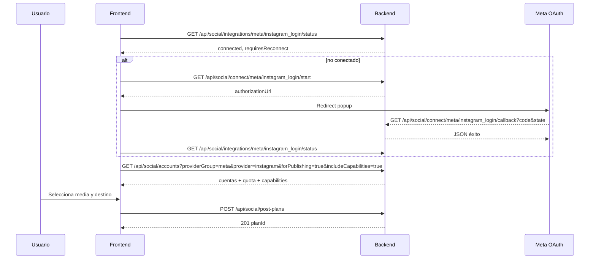
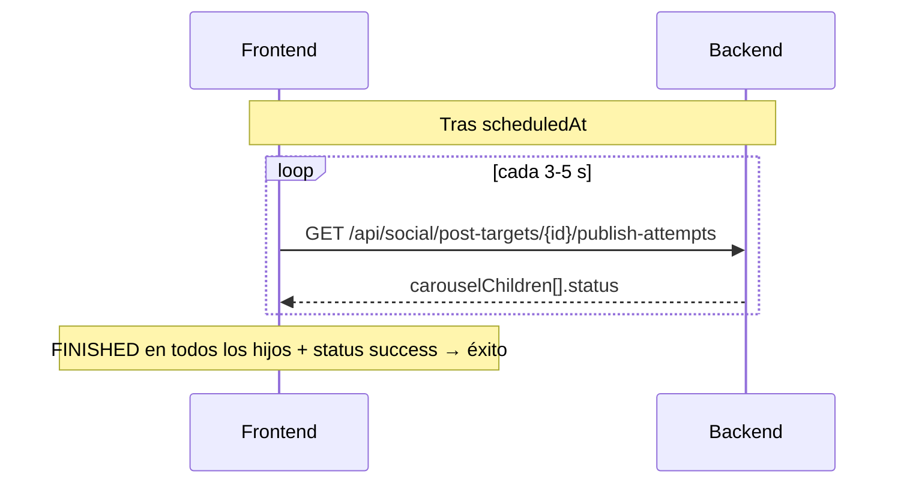

# Guía frontend: integración Instagram (Meta)

Documento para el equipo frontend con los endpoints backend implementados para conectar cuentas Instagram, programar publicaciones y consultar el estado de publish.

**Catálogo canónico de API:** [`docs/endpoints-redes-sociales-meta-facebook-linkedin.md`](endpoints-redes-sociales-meta-facebook-linkedin.md). Las rutas bajo `/api/meta/*` y `/api/postplan` **fueron eliminadas**; usar `/api/social/*`.

---

| Fase | Documento |
|------|-----------|
| Ecosistema Meta (modelo, OAuth, publish) | [`docs/Documentos requerimientos/meta-ecosistema-instagram-implementacion.md`](Documentos%20requerimientos/meta-ecosistema-instagram-implementacion.md) |
| Fase 1.5 — límites IG y capabilities | [`docs/Documentos requerimientos/meta-fase-1-5-limites-y-capabilities.md`](Documentos%20requerimientos/meta-fase-1-5-limites-y-capabilities.md) |
| Fase 2.0 — carrusel, video, Reels, proxy | [`docs/Documentos requerimientos/meta-fase-2-tipos-contenido-y-proxy-media.md`](Documentos%20requerimientos/meta-fase-2-tipos-contenido-y-proxy-media.md) |
| Fase 2.1 — carrusel mixto imagen + video | [`docs/Documentos requerimientos/meta-fase-2-1-carrusel-mixto.md`](Documentos%20requerimientos/meta-fase-2-1-carrusel-mixto.md) |

---

## 1. Objetivo funcional

- Conectar Instagram al tenant (vía login directo de Instagram o vía Facebook Page vinculada).
- Ver estado de conexión, cuentas publicables, capabilities y cupo de publicación.
- Programar posts de Instagram: imagen, carrusel, video feed o Reel.
- Consultar calendario de planes y detalle de intentos de publicación (incl. progreso por slide en carrusel).

La publicación real la ejecuta el backend de forma asíncrona (`MetaPublishJob`); el frontend **no** llama a la Graph API de Meta directamente.

---

## 2. Fases implementadas (mapa rápido)

| Fase | Qué aporta al frontend |
|------|------------------------|
| **1 — Ecosistema** | OAuth vía `/api/social/connect/meta/*`, estado en `/api/social/integrations/*`, cuentas en `/api/social/accounts`, sync, disconnect |
| **1.5 — Límites y capabilities** | `publishingQuota`, `capabilities`, `capabilitiesStale`, `minPublishingQuotaRemaining` |
| **2.0 — Tipos de contenido** | `planMedia[]`, imagen / carrusel (solo imágenes) / video / Reels, publish-attempts |
| **2.1 — Carrusel mixto** | Carrusel con imágenes + videos (si el entorno tiene `AllowMixedCarousel=true`) |

---

## 3. Autenticación y headers

En todos los endpoints autenticados (salvo callback OAuth y proxy de media):

```http
Authorization: Bearer <jwt>
X-Tenant-Id: <tenantIdActivo>
```

| Requisito | Detalle |
|-----------|---------|
| Política | `TenantMember` en la mayoría de rutas Meta y PostPlan create |
| Tipo de usuario | El JWT debe corresponder a un usuario `Customer` con membresía activa en el tenant del header |
| Formato respuesta | Envoltorio `ApiResponse<T>`: `{ "data": { ... } }` |

Errores de negocio en create de plan:

```json
{
  "message": "Texto legible",
  "errorCode": "META_IG_CAROUSEL_MIXED_NOT_SUPPORTED"
}
```

---

## 4. Endpoints — conexión OAuth (Fase 1)

Base: `/api/social/connect`

| Acción | Método y ruta | Auth |
|--------|---------------|------|
| Iniciar OAuth Facebook | `GET /api/social/connect/meta/facebook_login/start` | JWT + `TenantMember` |
| Iniciar OAuth Instagram | `GET /api/social/connect/meta/instagram_login/start` | JWT + `TenantMember` |
| Callback Facebook | `GET /api/social/connect/meta/facebook_login/callback?code=&state=` | `AllowAnonymous` |
| Callback Instagram | `GET /api/social/connect/meta/instagram_login/callback?code=&state=` | `AllowAnonymous` |
| Desconectar | `POST /api/social/integrations/meta/{connectionType}/disconnect` | JWT + `TenantMember` |

`connectionType` válidos: `facebook_login` | `instagram_login`.

> **Legacy eliminado:** ya no existen `/api/meta/connect/facebook/start` ni `/api/meta/connect/instagram/start`. El segmento intermedio es `{providerGroup}/{connectionType}` (p. ej. `meta/facebook_login`).

### 4.1 Iniciar conexión

```http
GET /api/social/connect/meta/instagram_login/start
Authorization: Bearer <jwt>
X-Tenant-Id: <tenantId>
```

Respuesta:

```json
{
  "data": {
    "authorizationUrl": "https://www.instagram.com/oauth/authorize?..."
  }
}
```

Flujo UX recomendado:

1. Llamar `start` con JWT y `X-Tenant-Id`.
2. Redirigir al usuario a `authorizationUrl` (ventana completa o popup).
3. Meta redirige al **callback del backend** (URL registrada en la app Meta).
4. El callback devuelve JSON (no redirige al SPA por defecto):

```json
{
  "data": {
    "accountsImported": 1,
    "errors": 0,
    "message": "Sincronización exitosa: 1 cuenta(s)."
  }
}
```

Si el callback abre en popup, cerrar la ventana y refrescar `GET /api/social/integrations/meta/instagram_login/status` (o `facebook_login/status`) en la app principal. El SPA implementa polling cada 2 s vía `SocialService.connectWithPopup()`.

### 4.2 Desconectar

```http
POST /api/social/integrations/meta/instagram_login/disconnect
Authorization: Bearer <jwt>
X-Tenant-Id: <tenantId>
```

---

## 5. Endpoints — estado y cuentas (Fase 1 + 1.5)

Bases: `/api/social/integrations` y `/api/social/accounts`

| Acción | Método y ruta | Auth |
|--------|---------------|------|
| Resumen por grupo (p. ej. Meta) | `GET /api/social/integrations/meta/status` | JWT + `TenantMember` |
| Estado por flujo OAuth | `GET /api/social/integrations/meta/{connectionType}/status` | JWT + `TenantMember` |
| Listar cuentas gestionadas | `GET /api/social/accounts` | JWT + `TenantMember` |
| Activar/desactivar cuenta | `PATCH /api/social/accounts/{id}/status` | JWT + `TenantMember` |
| Re-vincular cuenta revocada | `POST /api/social/accounts/{id}/reconnect` | JWT + `TenantMember` |
| Ocultar / mostrar en lista | `PATCH /api/social/accounts/{id}/visibility` | JWT + `TenantMember` |
| Eliminar historial | `DELETE /api/social/accounts/{id}` | JWT + `TenantMember` |
| Forzar sincronización | `POST /api/social/accounts/sync` | JWT + `TenantMember` |
| Validar cuenta (capabilities stale) | `POST /api/social/accounts/{id}/validate` | JWT + `TenantMember` |

### 5.1 Estado agregado (grupo Meta)

```http
GET /api/social/integrations/meta/status
```

Respuesta (campos relevantes IG):

```json
{
  "data": {
    "providerGroup": "meta",
    "connected": true,
    "totalAccounts": 3,
    "activeAccounts": 3,
    "canPublishAccounts": 2,
    "minPublishingQuotaRemaining": 48
  }
}
```

`minPublishingQuotaRemaining`: mínimo de publicaciones restantes entre cuentas IG activas (con cache en backend). Útil para badge global en el calendario.

### 5.1.1 Estado por flujo OAuth (`connectionType`)

```http
GET /api/social/integrations/meta/facebook_login/status
```

```json
{
  "data": {
    "connected": true,
    "tokenStatus": "Valid",
    "lastSyncStatus": "success",
    "lastSyncAt": "2026-06-26T10:00:00Z",
    "totalAccounts": 13,
    "activeAccounts": 2,
    "inactiveAccounts": 11,
    "lastSyncAccountsUpserted": 2,
    "hasInactiveAccounts": true,
    "requiresReconnect": false
  }
}
```

**Interpretación de capas (importante):**

| Campo | Qué mide | Dónde |
|-------|----------|-------|
| `connected` | Fila en `social_connection` con OAuth/token de flujo | grupo y `connectionType` |
| `totalAccounts` | Registros en BD (activas + inactivas) | grupo y `connectionType` |
| `activeAccounts` | Cuentas usables **ahora** (conectadas) | grupo y `connectionType` |
| `inactiveAccounts` | Histórico revocado/inactivo | solo `connectionType` |
| `lastSyncAccountsUpserted` | Upsertadas en el último sync | solo `connectionType` |
| `hasInactiveAccounts` | Hay cuentas viejas sin token (aviso UI) | solo `connectionType` |
| `canPublishAccounts` | Cuentas con token usable para publicar | solo grupo |
| `requiresReconnect` | Token OAuth del **flujo** inválido (no por cuentas inactivas) | `connectionType` |

**UI (Cuentas conectadas):**

- Badge «2 páginas conectadas» → `activeAccounts` del status `facebook_login`.
- Opcional «11 desvinculadas» → `inactiveAccounts` si `hasInactiveAccounts`.
- Detalle sync → `lastSyncStatus`, `lastSyncAt`, `lastSyncAccountsUpserted`, `tokenStatus` (OAuth).
- No usar `totalAccounts` como «importadas en este login»; es histórico en BD.
- `accountsImported` solo en respuesta del callback OAuth tras login.

Si `connected: true` pero `activeAccounts: 0`, el OAuth está bien pero no hay cuentas usables ahora — revisar sync o activar cuentas con token válido.

**Token revocado en cuenta concreta:** no basta con `PATCH /api/social/accounts/{id}/status` + `{ "isActive": true }`. Hace falta **re-sincronizar** (`POST /api/social/accounts/sync`) o **repetir OAuth** para guardar de nuevo el page access token.

### 5.2 Listado para selector de destinos (recomendado)

```http
GET /api/social/accounts?providerGroup=meta&provider=instagram&forPublishing=true&includeCapabilities=true
```

| Query | Comportamiento |
|-------|----------------|
| `providerGroup=meta` | Cuentas Meta (Facebook pages + Instagram) |
| `provider=instagram` | Solo cuentas Instagram |
| `forPublishing=true` | Solo cuentas publicables |
| `includeCapabilities=true` | Adjunta `capabilities`; en IG también consulta `publishingQuota` |

Cuenta Instagram (ejemplo):

```json
{
  "id": 42,
  "provider": "instagram",
  "providerGroup": "meta",
  "accountType": "business",
  "displayName": "Mi marca",
  "connectionType": "instagram_login",
  "isActive": true,
  "canPublish": true,
  "tokenStatus": "Valid",
  "requiresReconnect": false,
  "capabilities": {
    "canPublishImage": true,
    "canPublishCarousel": true,
    "canPublishVideo": true,
    "canPublishReels": true
  },
  "capabilitiesStale": false,
  "publishingQuota": {
    "quotaUsage": 2,
    "quotaTotal": 50,
    "quotaDurationSeconds": 86400,
    "remaining": 48,
    "canPublish": true,
    "queriedAt": "2026-06-25T10:00:00Z"
  }
}
```

**UI:** deshabilitar destinos con `canPublish=false`, `requiresReconnect=true` o `publishingQuota.canPublish=false`. Mostrar `publishingQuota.remaining` junto al nombre de la cuenta.

### 5.3 Activar / desactivar cuenta

```http
PATCH /api/social/accounts/42/status
Content-Type: application/json

{ "isActive": false }
```

Solo cambia visibilidad/uso en el tenant (`isActive`). **No refresca tokens.** Si la cuenta tiene `tokenStatus: "Revoked"`, activarla no la hace publicable: hace falta `POST /api/social/accounts/{id}/reconnect`, `POST /api/social/accounts/sync` o reconectar OAuth.

### 5.4 Re-vincular cuenta revocada

```http
POST /api/social/accounts/42/reconnect
Authorization: Bearer <jwt>
X-Tenant-Id: <tenantId>
```

Respuesta `200` con `SocialReconnectAccountResponseDto`:

| `outcome` | Acción UI |
|-----------|-----------|
| `success` | Actualizar tarjeta con `data.account` y refrescar status Meta |
| `oauth_required` | Mostrar `message` y redirigir a `authorizationUrl` (autorizar esa página en Facebook) |

Tras el callback OAuth el backend sincroniza; al volver a Cuentas conectadas (`ngOnInit`), la lista se recarga sola.

**UI (tarjeta desvinculada):** botón «Reconectar» → `POST …/reconnect`. Ya no interpretar `422`/`409` como error de reconnect; usar `outcome: oauth_required`.

### 5.5 Ocultar y eliminar historial

```http
PATCH /api/social/accounts/42/visibility
{ "hidden": true }

DELETE /api/social/accounts/42
```

| Acción UI | Endpoint | Notas |
|-----------|----------|-------|
| Ocultar de la lista | `PATCH …/visibility` `{ "hidden": true }` | No cambia tokens ni `isActive`. Excluida de `GET /accounts` por defecto. |
| Eliminar historial | `DELETE …/{id}` | Solo revocada + inactiva. Errores `409` con códigos específicos. |

Reconnect/sync exitoso restaura `isHiddenFromList: false`.

**UI (Cuentas conectadas):** en tarjetas desvinculadas revocadas: Reconectar (primario), Ocultar de la lista, Eliminar historial (secundario).

### 5.6 Multi-OAuth Facebook (varias cuentas Meta por tenant)

Guía de implementación frontend: [`docs/Gestor de archivos/frontend-multi-oauth-facebook-por-tenant.md`](Gestor%20de%20archivos/frontend-multi-oauth-facebook-por-tenant.md).

Pantalla **Cuentas conectadas** (`/dashboard/cuentas`): lista de conexiones OAuth, «Conectar otra cuenta Meta», sync/disconnect/reauth por `connectionId`, badge `connectionCount / maxConnectionsPerTenant`.

---

## 6. Endpoints — planes de publicación (Fase 2 + 2.1)

Base: `/api/social/post-plans`

| Acción | Método y ruta | Auth |
|--------|---------------|------|
| Crear plan + targets | `POST /api/social/post-plans` | JWT + `TenantMember` |
| Calendario | `GET /api/social/post-plans?from=&to=` | JWT |
| Detalle de plan | `GET /api/social/post-plans/{planId}` | JWT |
| Intentos de publicación | `GET /api/social/post-targets/{id}/publish-attempts` | JWT |

### 6.1 Crear publicación programada

```http
POST /api/social/post-plans
Content-Type: application/json
```

Body común:

```json
{
  "scheduledAt": "2026-06-26T15:00:00Z",
  "timezone": "America/Bogota",
  "message": "Texto del post",
  "destinations": [
    { "managedSocialAccountId": 42 }
  ]
}
```

`destinations` es **obligatorio** para Instagram (y Facebook en la API social). `pageIds` está **obsoleto**.

Preferir `providerOptions.instagram` sobre campos top-level `instagramContentType` / `instagramPublishAsReels`:

```json
{
  "providerOptions": {
    "instagram": {
      "contentType": "reel",
      "publishAsReels": true
    }
  }
}
```

Respuesta **201 Created**:

```json
{
  "data": {
    "planId": 1001,
    "targetsCreated": 1,
    "targetsSkipped": 0,
    "message": "Plan creado correctamente."
  }
}
```

Header `Location`: `/api/social/post-plans/{planId}`.

---

## 7. Medios y tipos de contenido Instagram

### 7.1 Fuente de medios

Los archivos deben existir en el **gestor de archivos** (`ComposerMedia`). El create de plan referencia `composerMediaId` (campo `composerMediaId` en `planMedia[]`).

Subir/importar medios con los endpoints de `api/media` (ver [`docs/Documentos requerimientos/composer-media-api-contract.md`](Documentos%20requerimientos/composer-media-api-contract.md)).

**Regla importante:** no enviar `mediaId` junto con `planMedia[]` o `mediaIds` en el mismo request → `400` `META_POST_PLAN_AMBIGUOUS_MEDIA_SOURCES`.

### 7.2 Campo `planMedia[]` (Fase 2+)

```json
{
  "planMedia": [
    { "composerMediaId": 10, "sortOrder": 0, "mediaRole": "carousel_item" },
    { "composerMediaId": 11, "sortOrder": 1, "mediaRole": "carousel_item" }
  ]
}
```

| Campo | Descripción |
|-------|-------------|
| `composerMediaId` | ID del medio en biblioteca |
| `sortOrder` | Orden en el carrusel (0-based); define orden en Instagram |
| `mediaRole` | `primary` (1 ítem), `carousel_item` (carrusel), `cover` (reservado) |

Atajo legacy: `mediaIds: [10, 11]` se normaliza a `planMedia` con `sortOrder` automático.

### 7.3 `instagramContentType`

Valores: `image` | `carousel` | `video` | `reels`.

Si se omite, el backend infiere:

| Condición | Tipo inferido |
|-----------|---------------|
| 2+ ítems en `planMedia` | `carousel` |
| 1 ítem `video/*` | `video` (luego Reels por default, ver abajo) |
| 1 ítem `image/*` | `image` |
| Sin media | `image` (pero IG exige media → error) |

### 7.4 Video feed vs Reel (Fase 2.0)

```json
{
  "instagramContentType": "video",
  "instagramPublishAsReels": true,
  "planMedia": [
    { "composerMediaId": 20, "sortOrder": 0, "mediaRole": "primary" }
  ]
}
```

| `instagramContentType` | `instagramPublishAsReels` | Resultado |
|------------------------|---------------------------|-----------|
| `video` | omitido o `true` | **Reel** (default producto) |
| `video` | `false` explícito | Video en **feed** |
| `reels` | ignorado | **Reel** |

**UX:** toggle “Publicar como Reel” **activado por defecto**.

Validar en UI con `capabilities.canPublishVideo` vs `capabilities.canPublishReels`.

### 7.5 Ejemplos por tipo

**Imagen individual**

```json
{
  "scheduledAt": "2026-06-26T15:00:00Z",
  "timezone": "UTC",
  "message": "Post imagen",
  "planMedia": [
    { "composerMediaId": 10, "sortOrder": 0, "mediaRole": "primary" }
  ],
  "destinations": [{ "managedSocialAccountId": 42 }]
}
```

**Carrusel solo imágenes (2–10 ítems)**

```json
{
  "instagramContentType": "carousel",
  "planMedia": [
    { "composerMediaId": 10, "sortOrder": 0, "mediaRole": "carousel_item" },
    { "composerMediaId": 11, "sortOrder": 1, "mediaRole": "carousel_item" },
    { "composerMediaId": 12, "sortOrder": 2, "mediaRole": "carousel_item" }
  ],
  "destinations": [{ "managedSocialAccountId": 42 }]
}
```

**Carrusel mixto imagen + video (Fase 2.1)**

```json
{
  "instagramContentType": "carousel",
  "planMedia": [
    { "composerMediaId": 10, "sortOrder": 0, "mediaRole": "carousel_item" },
    { "composerMediaId": 11, "sortOrder": 1, "mediaRole": "carousel_item" },
    { "composerMediaId": 20, "sortOrder": 2, "mediaRole": "carousel_item" }
  ],
  "destinations": [{ "managedSocialAccountId": 42 }]
}
```

Donde `10`/`11` son `image/*` y `20` es `video/mp4`.

### 7.6 Límites de validación (config backend)

Valores por defecto orientativos (`InstagramMediaValidation`):

| Regla | Default |
|-------|---------|
| Ítems carrusel | 2–10 |
| Imágenes | `image/jpeg`, `image/png`, máx. ~8 MiB |
| Videos | `video/mp4`, máx. ~100 MiB, duración máx. ~900 s |

---

## 8. Carrusel mixto — reglas Fase 2.1

El backend controla el carrusel mixto con flags de servidor (no hay endpoint público que los exponga):

| Flag servidor | Default prod | Efecto |
|---------------|--------------|--------|
| `AllowMixedCarousel` | `false` | Si hay video en carrusel → `400` `META_IG_CAROUSEL_MIXED_NOT_SUPPORTED` |
| `AllowVideoOnlyCarousel` | `false` | Carrusel solo videos → `400` `META_IG_CAROUSEL_VIDEO_ONLY_NOT_SUPPORTED` |

**Desarrollo** (`appsettings.Development.json`): `AllowMixedCarousel: true`.

**Recomendación UI:**

- Habilitar “añadir video al carrusel” según configuración de entorno acordada con ops (variable de build por ambiente) **o** detectar el error al intentar create.
- Carrusel mixto MVP: **al menos 1 imagen** si hay videos (no ofrecer carrusel 100 % video hasta que ops active `AllowVideoOnlyCarousel`).
- No ofrecer Reels dentro del carrusel; Reels siguen siendo publicación individual.
- Validar `capabilities.canPublishCarousel` (no hay capability nueva para mixto).

---

## 9. Consultar planes y estado de publicación

### 9.1 Calendario

```http
GET /api/social/post-plans?from=2026-06-01&to=2026-06-30&status=Pending
```

Query opcionales: `status`, `onlyWithPublishableTargets`, `q` (búsqueda en mensaje).

Cada ítem incluye `status` agregado del plan: `Pending`, `Published`, `Failed`, `Partial`, `Canceled` y `targetsSummary` para badges tipo `2/3`.

### 9.2 Detalle de plan

```http
GET /api/social/post-plans/{planId}
```

**Limitación actual:** el DTO de targets en detalle sigue orientado a Facebook Page (`facebookPageId`, `name` de página). Para targets Instagram, usar el endpoint de publish-attempts con el `postTargetId` obtenido del modelo interno o ampliar el DTO en una iteración futura.

### 9.3 Intentos de publicación (Fase 2+)

```http
GET /api/social/post-targets/{postTargetId}/publish-attempts
```

Respuesta:

```json
{
  "data": [
    {
      "id": 501,
      "attemptNumber": 1,
      "phase": "process_media",
      "creationContainerId": "carousel-parent-1",
      "containerStatus": "FINISHED",
      "publishedExternalId": "1799...",
      "status": "success",
      "lastAttemptAt": "2026-06-26T15:05:00Z",
      "errorCode": null,
      "errorUserMessage": null,
      "carouselChildren": [
        {
          "composerMediaId": 10,
          "sortOrder": 0,
          "mimeType": "image/jpeg",
          "containerId": "child-1",
          "status": "FINISHED"
        },
        {
          "composerMediaId": 20,
          "sortOrder": 2,
          "mimeType": "video/mp4",
          "containerId": "child-3",
          "status": "FINISHED"
        }
      ]
    }
  ]
}
```

### 9.4 Estados de `PostTarget`

| Status | Significado UI |
|--------|----------------|
| `Pending` | Programado, aún no procesado |
| `Publishing` | Job en curso |
| `Published` | Publicado en Instagram |
| `Failed` | Falló tras reintentos |
| `RetryPending` | Esperando cupo IG o backoff (no es fallo definitivo) |
| `Skipped` | Omitido (token inválido, cuenta inactiva, etc.) |
| `Cancelled` | Cancelado |

**Cupo Instagram:** si `RetryPending` por límite 24 h, mostrar “Esperando cupo de Instagram”. Si pasa a `Failed` con `META_IG_PUBLISHING_LIMIT_TIMEOUT`, el cupo no se liberó a tiempo.

### 9.5 Progreso en UI

| Tipo | Fuente de verdad |
|------|------------------|
| Video / Reel individual | `phase` (`create_container` → `process_media` → `publish`), `containerStatus` |
| Carrusel (imágenes o mixto) | **`carouselChildren[].status`** por slide |

Estados hijo: `IN_PROGRESS`, `FINISHED`, `ERROR`.

**Importante (carrusel mixto):** no inferir progreso por slide solo desde `phase`; en mixto `phase` alterna entre pasos del último hijo video procesado.

Polling UX sugerido tras `scheduledAt`: consultar `publish-attempts` cada 3–5 s mientras el target esté `Publishing` o `RetryPending`, con timeout razonable (carrusel con varios videos puede tardar varios minutos).

---

## 10. Proxy de media (informativo)

El backend puede servir medios a Meta mediante URL firmada:

```http
GET /api/media/{mediaId}/publish-proxy?token=<hmac>
```

- `AllowAnonymous` — la consume **Meta**, no el frontend.
- El frontend solo necesita subir medios al gestor (`composerMediaId`); no construir URLs públicas para publish.

---

## 11. Códigos de error relevantes

| `errorCode` | Cuándo | HTTP típico |
|-------------|--------|-------------|
| `META_INSTAGRAM_MEDIA_REQUIRED` | Plan IG sin imagen/video | 400 |
| `META_POST_PLAN_AMBIGUOUS_MEDIA_SOURCES` | `mediaId` + `planMedia` juntos | 400 |
| `META_CAPABILITY_NOT_SUPPORTED` | Cuenta sin capability para el tipo | 400 |
| `META_IG_CAROUSEL_ITEM_COUNT_INVALID` | Carrusel &lt; 2 o &gt; 10 ítems | 400 |
| `META_IG_CAROUSEL_MIXED_NOT_SUPPORTED` | Video en carrusel con mixto deshabilitado | 400 |
| `META_IG_CAROUSEL_VIDEO_ONLY_NOT_SUPPORTED` | Carrusel solo videos sin flag | 400 |
| `META_IG_MEDIA_MIME_NOT_ALLOWED` | MIME no permitido | 400 |
| `META_IG_MEDIA_TOO_LARGE` | Archivo excede tamaño | 400 |
| `META_IG_MEDIA_DURATION_EXCEEDED` | Video demasiado largo | 400 |
| `META_IG_PUBLISHING_LIMIT_EXCEEDED` | Cupo 24 h agotado al crear | 400 |
| `META_IG_PUBLISHING_LIMIT_UNAVAILABLE` | Graph no respondió cupo | 400/503 |
| `META_IG_CONTAINER_PROCESSING_FAILED` | Meta rechazó el contenedor | — (en attempt) |
| `META_IG_CONTAINER_PROCESSING_TIMEOUT` | Polling agotado | — (target Failed) |
| `META_IG_CONTAINER_EXPIRED` | Contenedor expiró en Meta | — (en attempt) |

Mensajes de usuario: usar `message` del error en create; en publish usar `errorUserMessage` del attempt si existe.

---

## 12. Flujos UX recomendados

### 12.1 Conectar Instagram y programar post



### 12.2 Seguimiento de publicación carrusel mixto



---

## 13. Checklist de implementación frontend

- [x] Pantalla conexión Meta: status por `connectionType` + OAuth Instagram/Facebook vía `/api/social/connect/meta/*/start`.
- [x] Selector de destinos: `GET /api/social/accounts?forPublishing=true&includeCapabilities=true`.
- [x] Composer: subir media vía gestor; armar `planMedia[]` con `sortOrder`.
- [x] Toggle Reel por defecto ON en video individual (`providerOptions.instagram.publishAsReels`).
- [x] Carrusel: multi-select 2–10; video en carrusel según flag de entorno.
- [x] Calendario: `GET /api/social/post-plans?from&to`.
- [x] Detalle publish IG: `GET /api/social/post-targets/{id}/publish-attempts` con progreso por `carouselChildren`.
- [x] Manejo de errores por `errorCode` (tabla §11).
- [x] Estados `RetryPending` vs `Failed` para cupo Instagram.

---

## 14. Fuera de alcance (no implementado aún)

- Edición o cancelación de planes vía API dedicada (solo create + lectura).
- Reanudación parcial de hijos de carrusel fallidos.
- Reels dentro de carrusel.
- Endpoint público de feature flags (`AllowMixedCarousel`).
- Detalle de plan con targets Instagram enriquecidos (usar publish-attempts).

---

## 16. Implementación en SPA

Rutas y componentes implementados en el frontend:

| Área | Ruta / componente |
|------|-------------------|
| OAuth Meta (popup) | `SocialService` / `MetaConnectService` (facade), `app-meta-connect` |
| Cuentas conectadas | `/dashboard/cuentas` — `GET /api/social/accounts`, `/api/social/integrations/*/status` |
| Composer Instagram | `post-composer.component` — `destinations`, `planMedia`, `providerOptions.instagram` |
| Publicación | `POST /api/social/post-plans`, `GET /api/social/post-targets/{id}/publish-attempts` |
| Calendario | `/dashboard/programador` — badge cupo IG desde `GET /api/social/integrations/meta/status` |
| Colecciones | `segments.service` — items con `managedSocialAccountIds` |

**API canónica:** toda la superficie social vive bajo `/api/social/*` (ver [`docs/endpoints-redes-sociales-meta-facebook-linkedin.md`](endpoints-redes-sociales-meta-facebook-linkedin.md)). Las rutas legacy `/api/meta/*`, `/api/postplan` y `/api/Facebook/pages` fueron eliminadas.

**OAuth legacy deprecado:** `/facebook-callback` y `/facebook-connected` redirigen a `/dashboard/cuentas`. El flujo actual usa `GET /api/social/connect/meta/{facebook_login|instagram_login}/start` y polling de `GET /api/social/integrations/meta/{connectionType}/status`.

**Fuera de alcance en frontend (sin endpoint social):** analytics FB, grupos FB, mensajería (`/api/Facebook/analytics|groups|messaging`).

---

## 17. Referencias adicionales

- Gestor de archivos / media: [`docs/Documentos requerimientos/gestor-archivos-backend-endpoints.md`](Documentos%20requerimientos/gestor-archivos-backend-endpoints.md)
- Patrón guía similar: [`docs/frontend-integracion-canva-gestor-archivos.md`](frontend-integracion-canva-gestor-archivos.md)
