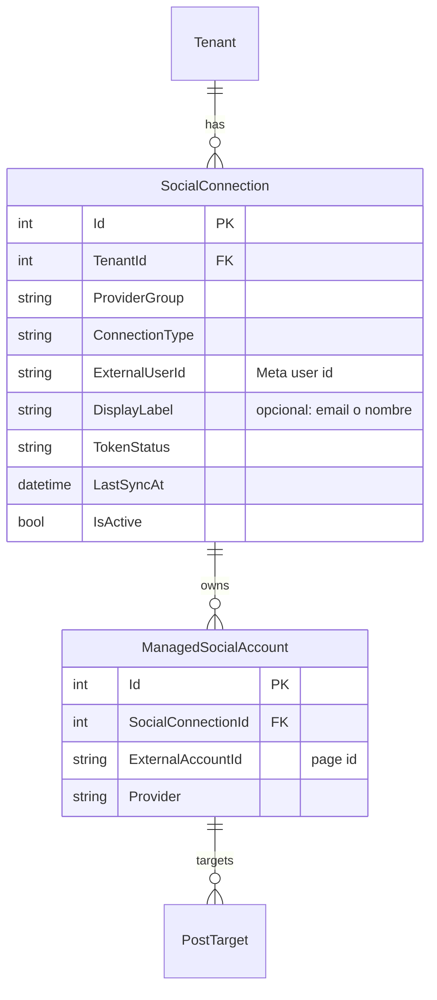
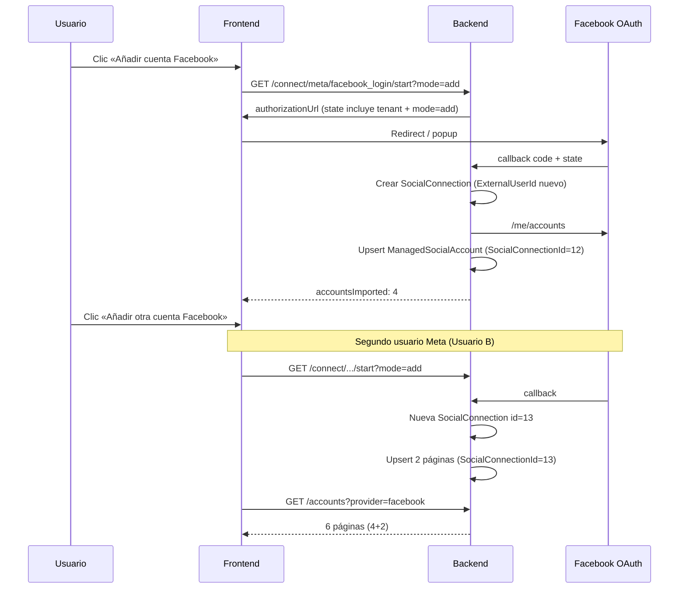

# Plan de implementación — Varios OAuth Meta (Facebook Pages) por tenant

**Fecha:** 24 junio 2026  
**Estado:** Propuesta de diseño (pendiente implementación backend + frontend)  
**Relacionado:** [`endpoints-redes-sociales-meta-facebook-linkedin.md`](endpoints-redes-sociales-meta-facebook-linkedin.md), [`frontend-integracion-instagram-meta.md`](frontend-integracion-instagram-meta.md)

---

## 1. Problema de negocio

Un tenant debe poder publicar en **6 páginas de Facebook** administradas desde **dos cuentas personales de Meta distintas**:

| Cuenta Facebook (usuario Meta) | Páginas |
|--------------------------------|---------|
| Usuario A | 4 páginas |
| Usuario B | 2 páginas |

**Total:** 6 `ManagedSocialAccount` publicables en el mismo workspace.

### Limitación del diseño actual

Hoy el modelo es:

```text
Tenant + connectionType (facebook_login) → 1 SocialConnection → N ManagedSocialAccount
```

- Un solo token OAuth activo por tenant y flujo `facebook_login`.
- El sync importa páginas desde `/me/accounts` del **último** usuario que autorizó.
- Un segundo OAuth **reemplaza** la conexión anterior: las páginas ligadas al primer usuario quedan sin token válido.

**Conclusión:** el API actual **no soporta** dos usuarios Meta simultáneos para Facebook Pages en el mismo tenant.

---

## 2. Objetivo

Permitir **varias conexiones OAuth simultáneas** por tenant y `connectionType`, manteniendo compatibilidad con tenants que solo usan una cuenta Facebook.

### Criterios de aceptación

1. El usuario puede conectar Usuario A → importar 4 páginas.
2. Sin desconectar A, puede **«Añadir otra cuenta Facebook»** → conectar Usuario B → importar 2 páginas.
3. Las 6 páginas aparecen en `GET /api/social/accounts` con tokens válidos independientes.
4. Reconnect/sync de una página usa el OAuth de **su** `SocialConnection`, no el global del tenant.
5. Desconectar Usuario A no revoca tokens de las páginas de Usuario B.
6. Límites del plan (`limit.facebook.pages`, `limit.integrations`) siguen aplicando al total de páginas activas del tenant.

---

## 3. Modelo de datos propuesto

### 3.1 Entidades



### 3.2 Cambios en BD

| Tabla | Cambio |
|-------|--------|
| `social_connection` | Quitar unicidad `(TenantId, ConnectionType)` si existe. Añadir índice único `(TenantId, ConnectionType, ExternalUserId)` para no duplicar el mismo usuario Meta. |
| `social_connection` | Columnas nuevas: `ExternalUserId` (string), `DisplayLabel` (nullable), `ConnectedAt`, `IsActive`. |
| `managed_social_account` | Ya debe tener `SocialConnectionId` FK; validar NOT NULL para cuentas Meta FB/IG. |
| `social_oauth_session` | Campo opcional `SocialConnectionId` (null = crear conexión nueva; valor = reautorizar conexión existente). |

### 3.3 Reglas de negocio

| Regla | Descripción |
|-------|-------------|
| Máximo conexiones | Configurable por plan, ej. `limit.facebook.oauth_connections` (default 3). |
| Misma cuenta Meta dos veces | Rechazar con `409 SOCIAL_CONNECTION_ALREADY_EXISTS` o hacer upsert/reauth de la fila existente. |
| Sync por conexión | `POST …/connections/{connectionId}/sync` solo afecta páginas de esa conexión. |
| Revocación parcial | Si Meta revoca token de Usuario A, solo cuentas hijas de esa conexión pasan a `Revoked`. |
| Instagram | Misma mecánica opcional en fase 2 (`instagram_login` multi-OAuth). Fase 1: solo `facebook_login`. |

---

## 4. API — diseño de endpoints

Convención: rutas nuevas bajo `/api/social/connections`. Los endpoints actuales por `connectionType` pasan a ser **agregados** (suma de todas las conexiones del flujo).

### 4.1 Nuevos endpoints

| Método | Ruta | Descripción |
|--------|------|-------------|
| `GET` | `/api/social/connections` | Lista conexiones del tenant. Query: `providerGroup`, `connectionType`. |
| `GET` | `/api/social/connections/{connectionId}` | Detalle de una conexión + contadores. |
| `POST` | `/api/social/connections/{connectionId}/sync` | Sync `/me/accounts` solo para esa conexión. |
| `POST` | `/api/social/connections/{connectionId}/disconnect` | Revoca OAuth de **una** conexión; desactiva/revoca solo sus cuentas hijas. |
| `GET` | `/api/social/connect/{providerGroup}/{connectionType}/start` | **Ampliado:** query `mode=add` (default) \| `reauth`, opcional `connectionId` para reautorizar. |

### 4.2 Endpoints existentes — comportamiento revisado

| Endpoint | Cambio |
|----------|--------|
| `GET …/integrations/meta/facebook_login/status` | Sigue existiendo como **resumen agregado** del flujo. `connected: true` si hay ≥1 conexión activa. `connectionId` pasa a ser opcional o se elimina del DTO agregado. |
| `POST …/integrations/meta/facebook_login/disconnect` | **Deprecar** a favor de disconnect por `connectionId`. Alternativa: desconectar **todas** las conexiones del flujo (con confirmación UI). |
| `GET /api/social/accounts` | Sin cambio de ruta. Cada item incluye `socialConnectionId` (nuevo campo en DTO). |
| `POST /api/social/accounts/{id}/reconnect` | Usa `ManagedSocialAccount.SocialConnectionId` para generar `authorizationUrl` del OAuth correcto. |
| `POST /api/social/accounts/sync` | Sync **global**: itera todas las conexiones activas `facebook_login` del tenant (o query `connectionId`). |

### 4.3 DTOs propuestos

**`SocialConnectionDto`**

```json
{
  "id": 12,
  "providerGroup": "meta",
  "connectionType": "facebook_login",
  "externalUserId": "102233445566778",
  "displayLabel": "maria@empresa.com",
  "tokenStatus": "Valid",
  "isActive": true,
  "connectedAt": "2026-06-20T14:00:00Z",
  "lastSyncAt": "2026-06-24T09:00:00Z",
  "lastSyncStatus": "success",
  "totalAccounts": 4,
  "activeAccounts": 3,
  "inactiveAccounts": 1,
  "requiresReconnect": false
}
```

**`SocialConnectionTypeStatusDto` (agregado)** — compatible con frontend actual:

```json
{
  "providerGroup": "meta",
  "connectionType": "facebook_login",
  "connected": true,
  "connectionCount": 2,
  "totalAccounts": 6,
  "activeAccounts": 5,
  "inactiveAccounts": 1,
  "hasInactiveAccounts": true,
  "requiresReconnect": false
}
```

**`SocialAccountDto`** — campo adicional:

```json
{
  "id": 101,
  "socialConnectionId": 12,
  "provider": "facebook",
  "externalAccountId": "123456789012345",
  "displayName": "Mi Página A1"
}
```

### 4.4 OAuth — flujo «Añadir cuenta»



**Query params en `start`:**

| Param | Valores | Uso |
|-------|---------|-----|
| `mode` | `add` (default), `reauth` | `add` crea conexión si el Meta user es nuevo; `reauth` exige `connectionId`. |
| `connectionId` | int | Reautorizar conexión existente (mismo ExternalUserId). |

### 4.5 Errores nuevos

| HTTP | Código | Condición |
|------|--------|-----------|
| `409` | `SOCIAL_CONNECTION_ALREADY_EXISTS` | OAuth `mode=add` pero el Meta user ya está conectado en el tenant |
| `409` | `SOCIAL_CONNECTION_LIMIT_REACHED` | Supera `limit.facebook.oauth_connections` |
| `404` | `SOCIAL_CONNECTION_NOT_FOUND` | `connectionId` inválido para el tenant |

---

## 5. Caso de uso — 6 páginas en 2 cuentas Facebook

### Paso a paso (usuario final)

1. **Conectar primera cuenta**  
   - Botón: «Conectar Facebook» o «Añadir cuenta Facebook».  
   - Login como Usuario A, autorizar 4 páginas.  
   - Resultado: 4 tarjetas en «Páginas de Facebook», resumen «4 conectadas».

2. **Conectar segunda cuenta**  
   - Botón: «Añadir otra cuenta Facebook» (nuevo; no reemplaza la primera).  
   - Login como Usuario B, autorizar 2 páginas.  
   - Resultado: 6 tarjetas total; bloque opcional «Cuentas Facebook conectadas (2)» listando Usuario A y Usuario B.

3. **Publicar**  
   - Composer: `GET /accounts?forPublishing=true` devuelve las 6; cada una publica con el page token de su conexión.

4. **Desconectar solo Usuario A**  
   - En detalle conexión 12 → «Desconectar esta cuenta Facebook».  
   - Las 4 páginas de A pasan a revocadas/inactivas; las 2 de B siguen publicables.

### Qué NO debe pasar

- Tras conectar Usuario B, las 4 páginas de A **no** deben quedar revocadas si A sigue con conexión activa.
- Reconnect de una página de A **no** debe forzar login de B.

---

## 6. Frontend — cambios propuestos

Base: pantalla `cuentas-conectadas` (`src/app/features/dashboard/components/cuentas-conectadas/`).

### 6.1 Modelos (`social.model.ts`)

```typescript
export interface SocialConnection {
  id: number;
  providerGroup: SocialProviderGroup;
  connectionType: SocialConnectionType;
  externalUserId: string;
  displayLabel?: string;
  tokenStatus: string;
  isActive: boolean;
  connectedAt?: string;
  lastSyncAt?: string;
  lastSyncStatus?: string;
  totalAccounts: number;
  activeAccounts: number;
  inactiveAccounts: number;
  requiresReconnect: boolean;
}

// SocialAccount: añadir socialConnectionId?: number
// SocialConnectionTypeStatus: añadir connectionCount?: number
```

### 6.2 Servicio (`social.service.ts`)

| Método nuevo | API |
|--------------|-----|
| `getConnections(query)` | `GET /api/social/connections` |
| `syncConnection(id)` | `POST /api/social/connections/{id}/sync` |
| `disconnectConnection(id)` | `POST /api/social/connections/{id}/disconnect` |
| `startConnect(..., { mode: 'add' \| 'reauth', connectionId? })` | query en `start` |

### 6.3 UI — Cuentas conectadas

| Elemento | Cambio |
|----------|--------|
| Cabecera Meta Facebook | «Conectar Facebook» → primera conexión; «+ Añadir cuenta Facebook» si `connectionCount >= 1`. |
| Nueva sección | «Cuentas Facebook autorizadas» — lista compacta de `SocialConnection` con label, # páginas, sync/desconectar por fila. |
| Páginas | Sin cambio de grid principal/desvinculadas; opcional badge «Cuenta: maria@…» en tarjeta si hay multi-OAuth. |
| Desconectar global | Renombrar a «Desconectar todas las cuentas Facebook» con confirmación fuerte. |
| Reconnect | Sin cambio de UX; backend devuelve `authorizationUrl` scoped a la conexión de la página. |

### 6.4 Entitlements

- Validar `limit.facebook.pages` contra **total páginas activas** (todas las conexiones).
- Nuevo límite opcional `limit.facebook.oauth_connections` para cap de cuentas Meta distintas.

---

## 7. Migración y compatibilidad

### 7.1 Datos existentes

1. Cada tenant con una fila `social_connection` actual → sin cambios; `ExternalUserId` backfill desde token Meta en migración o primer sync.
2. `managed_social_account.social_connection_id` → asignar FK a la única conexión existente del flujo correspondiente.

### 7.2 Compatibilidad API

| Cliente antiguo | Comportamiento |
|-----------------|----------------|
| `GET …/facebook_login/status` | Sigue funcionando; respuesta agregada + campos nuevos opcionales. |
| `POST …/facebook_login/disconnect` | Desconecta **todas** las conexiones del flujo (documentar breaking semantic si antes era una sola). |
| `GET /accounts` | Ignora `socialConnectionId` si no lo conoce. |

### 7.3 Migración EF sugerida

`AddMultiSocialConnectionPerTenant`:

- Drop unique index `(TenantId, ConnectionType)` en `social_connection`.
- Add columns + unique `(TenantId, ConnectionType, ExternalUserId)`.
- Backfill script.

---

## 8. Publicación y sync

| Operación | Alcance |
|-----------|---------|
| Publish post-target | Usa page token de `ManagedSocialAccount` → su `SocialConnection` (sin cambio de contrato en post-plans). |
| Sync global | Todas las conexiones `facebook_login` activas del tenant. |
| Sync por conexión | Solo páginas hijas de esa conexión; no marca revocadas páginas de otras conexiones. |
| Token refresh | Por conexión; fallo en A no afecta B. |

---

## 9. Seguridad y auditoría

- Registrar en log/audit: `connectionId`, `externalUserId`, tenant, acción (connect, disconnect, sync).
- OAuth `state` debe incluir `connectionId` en modo `reauth` para evitar CSRF y mezcla de sesiones.
- Un `TenantMember` solo ve conexiones de su tenant (`X-Tenant-Id`).

---

## 10. Plan de implementación por fases

### Fase 1 — Backend core (Facebook Pages)

- [ ] Migración BD multi-conexión
- [ ] `GET /connections`, `POST /connections/{id}/sync`, `POST /connections/{id}/disconnect`
- [ ] OAuth `start` con `mode=add|reauth`
- [ ] Sync/reconnect scoped por `SocialConnectionId`
- [ ] Status agregado + tests integración (escenario 4+2 páginas)

### Fase 2 — Frontend

- [ ] Modelos y `SocialService`
- [ ] UI «Añadir cuenta Facebook» + lista de conexiones
- [ ] Ajuste disconnect/reconnect/sync
- [ ] Actualizar docs canónicas

### Fase 3 — Instagram + límites plan

- [ ] Extender multi-OAuth a `instagram_login` si aplica
- [ ] Entitlement `limit.facebook.oauth_connections`
- [ ] Métricas y alertas por conexión

---

## 11. Plan de pruebas (escenario 6 páginas)

| # | Caso | Resultado esperado |
|---|------|-------------------|
| 1 | OAuth Usuario A, 4 páginas | 4 accounts, 1 connection, status `connectionCount: 1` |
| 2 | OAuth Usuario B sin desconectar A, 2 páginas | 6 accounts, 2 connections |
| 3 | Publicar en página de B | Target OK con token de conexión B |
| 4 | Disconnect conexión A | 4 revocadas, 2 activas |
| 5 | Reconnect página de A | OAuth Usuario A, página recuperada |
| 6 | `mode=add` con Usuario A otra vez | 409 o reauth según política |
| 7 | Sync conexión B only | No altera tokens de páginas A |
| 8 | Límite plan 5 páginas activas | Activar 6.ª bloqueada con mensaje claro |

---

## 12. Alternativa descartada (sin multi-OAuth)

Centralizar las 6 páginas bajo **un solo usuario Meta** con roles en Meta Business Suite.

| Pros | Contras |
|------|---------|
| Sin cambios de API | Dependencia operativa del cliente |
| | No siempre es posible (agencias, franquicias) |

Este plan cubre el caso en que **no** se puede unificar bajo un login Meta.

---

## 13. Referencias cruzadas (actualizar tras implementar)

| Documento | Acción |
|-----------|--------|
| `docs/endpoints-redes-sociales-meta-facebook-linkedin.md` | Añadir § Connections + campos DTO |
| `docs/frontend-integracion-instagram-meta.md` | § Multi-OAuth Facebook + UI |
| `src/app/features/social/models/social.model.ts` | Tipos `SocialConnection`, `socialConnectionId` |

---

## 14. Resumen ejecutivo

| Pregunta | Respuesta |
|----------|-----------|
| ¿Soporta el API hoy 4+2 páginas en 2 cuentas Facebook? | **No** |
| ¿Qué hay que cambiar? | Varios `SocialConnection` por tenant; sync/reconnect/disconnect por conexión |
| ¿Rompe clientes actuales? | Mínimo si status y `/accounts` siguen siendo agregados + campos nuevos opcionales |
| ¿Esfuerzo estimado? | Backend: medio-alto. Frontend: medio. |
